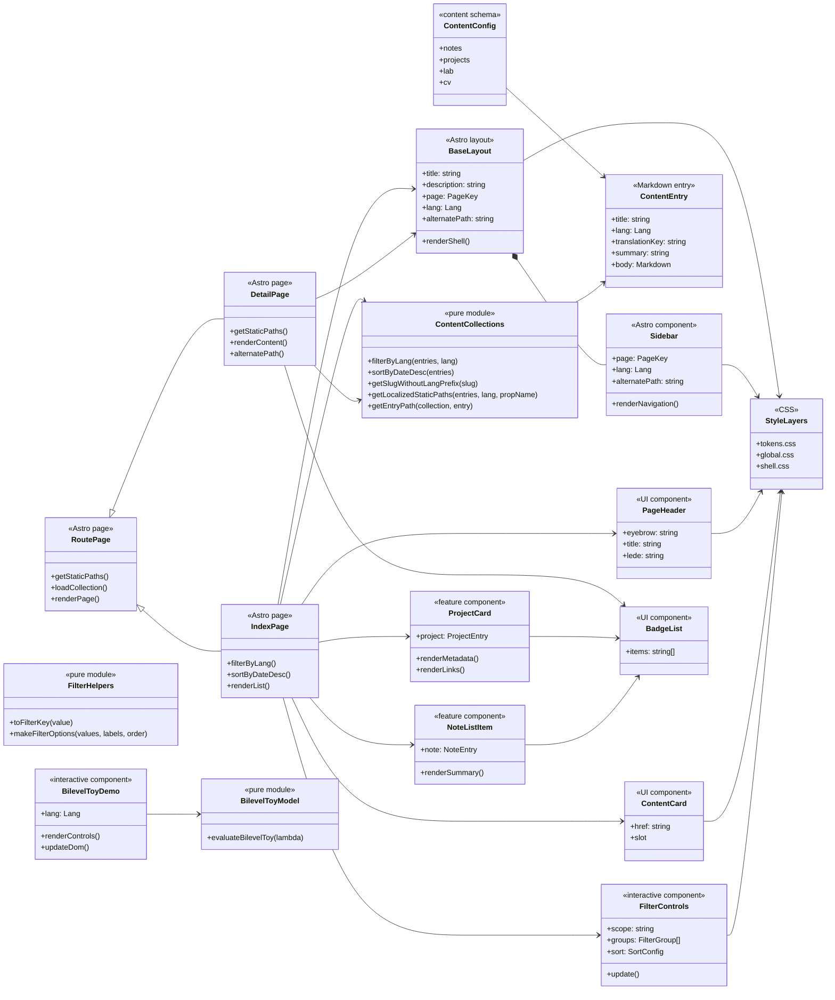

# Astro Frontend Architecture

**Status:** Active reference
**Date:** 2026-07-10
**Scope:** `src/layouts`, `src/pages`, `src/components`, `src/content`, `src/lib`, `src/styles`

## Purpose

This document records the current frontend architecture of the portfolio after the Astro migration. It is based on the inspected source tree, not on older React/Vite planning docs.

The site is a content-first static Astro portfolio. Pages are route-owned, content is file-backed through Astro content collections, visual primitives are semantic Astro components plus CSS tokens, and client JavaScript is limited to explicit interaction surfaces.

## Architectural Rules

- `src/pages/**` owns routes and route-level data loading.
- `src/layouts/Base.astro` owns the document shell, language attribute, theme bootstrap, sidebar, and main content frame.
- `src/content/**` owns durable authoring sources for notes, projects, lab entries, and CV profiles.
- `src/content/config.ts` owns typed frontmatter schemas.
- `src/lib/**` owns reusable data shaping and domain calculations.
- `src/components/**` owns rendering primitives and focused interactive fragments.
- `src/styles/**` owns the design system through CSS tokens and semantic shell classes.
- Korean and English pages remain mirrored through `/` and `/en/` route trees.

## Current Refactor

The lab toy calculation now lives in `src/lib/lab/bilevelToy.ts`, and `src/components/lab/BilevelToyDemo.astro` imports it instead of duplicating the formula inside the component script.

Dynamic detail routes now use `getLocalizedStaticPaths()` from `src/lib/content/collections.ts` instead of hand-writing the same language filter, slug cleanup, and props mapping in each `[slug].astro` file.

These changes keep route pages responsible for choosing a collection and language, while shared URL generation and pure lab calculations live in reusable TypeScript modules.

## Route Structure

| Route owner | Korean route | English route | Data source |
|---|---|---|---|
| Home | `/` | `/en/` | page-local content |
| About | `/about/` | `/en/about/` | page-local content |
| Projects index | `/projects/` | `/en/projects/` | `projects` collection |
| Project detail | `/projects/[slug]/` | `/en/projects/[slug]/` | `projects` collection |
| Notes index | `/notes/` | `/en/notes/` | `notes` collection |
| Note detail | `/notes/[slug]/` | `/en/notes/[slug]/` | `notes` collection |
| Lab index | `/lab/` | `/en/lab/` | `lab` collection |
| Lab detail | `/lab/[slug]/` | `/en/lab/[slug]/` | `lab` collection |
| CV | `/cv/` | `/en/cv/` | `cv` collection |

## Class Diagram

## Layer Responsibilities

### Routing Layer

`src/pages/**` should stay thin. It loads content collections, applies reusable filters, computes `alternatePath`, and passes data into components.

Dynamic routes use `getStaticPaths()` so project, note, and lab detail pages are generated at build time.

### Content Layer

`src/content/config.ts` defines the allowed metadata shapes. Markdown files under `src/content/**` are the authoring source.

The architecture depends on `lang` and `translationKey` being present for mirrored Korean/English entries. A missing pair is a content quality issue, not a component concern.

### Data and Domain Layer

`src/lib/content/collections.ts` handles language filtering, date sorting, slug cleanup, localized static path construction, and route path construction.

`src/lib/content/filters.ts` handles filter key normalization and option construction.

`src/lib/lab/bilevelToy.ts` handles the pure lower-level/upper-level toy calculation for the lab demo. Future lab models should follow this pattern before adding client code.

### Rendering Layer

Shared visual primitives live in `src/components/ui/**`. Feature components live under `src/components/project`, `src/components/content`, `src/components/cv`, and `src/components/lab`.

Presentational components may read display props and render semantic HTML. They should not fetch collections or reshape content beyond view-local formatting.

### Interaction Layer

The default is zero client JavaScript. Current exceptions are:

- `Base.astro`: inline theme bootstrap before paint.
- `FilterControls.astro`: list filtering and sorting for index pages.
- `ThemeToggle.astro`: user theme switching.
- `BilevelToyDemo.astro`: browser-only slider demo.

Any new interaction should remain isolated to a component or island and should not turn content pages into a full client app.

### Styling Layer

`tokens.css` defines design variables, `global.css` defines global page behavior, and `shell.css` defines semantic layout/component classes.

Production Astro files should keep using semantic classes instead of inline utility-heavy styling.

## Extension Rules

When adding a new route:

1. Add both Korean and English routes, or explicitly document why parity is deferred.
2. Keep collection loading in the route page.
3. Move reusable transformations into `src/lib/**`.
4. Render through existing UI primitives before creating new components.
5. Run `npm run build`.

When adding a new lab demo:

1. Put pure model logic in `src/lib/lab/**`.
2. Keep DOM and event handling in the lab component.
3. Hydrate only the demo surface that needs interaction.
4. Add a static Markdown lab entry under `src/content/lab/**`.
5. Verify the static route still builds.

## Remaining Assumptions

- The current `docs/adr-001-portfolio-platform-architecture.md` is historical and contains pre-migration React/Vite planning context.
- The current Astro architecture is static-first; no backend API boundary is present in this repo.
- Content parity is route-level and file-level, not enforced by an automated test yet.
