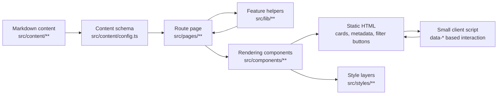
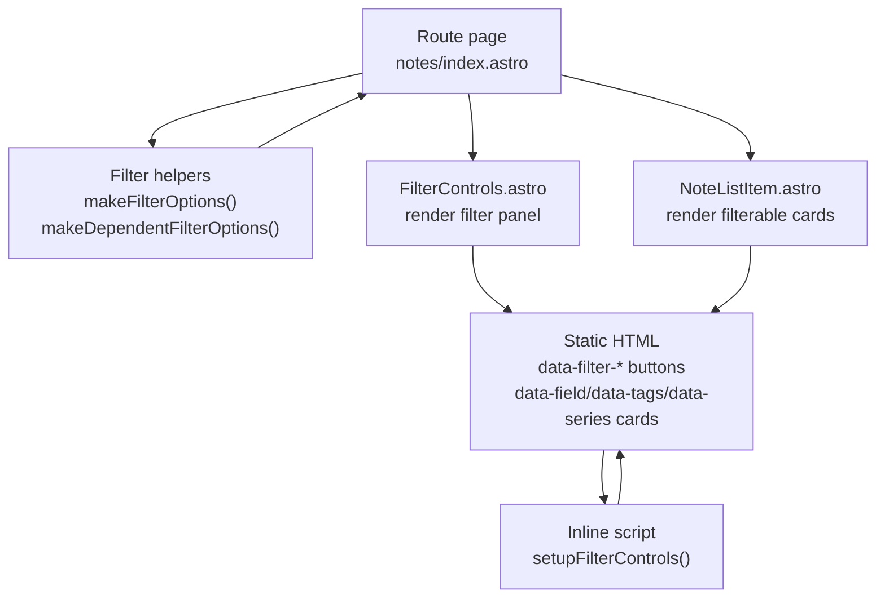
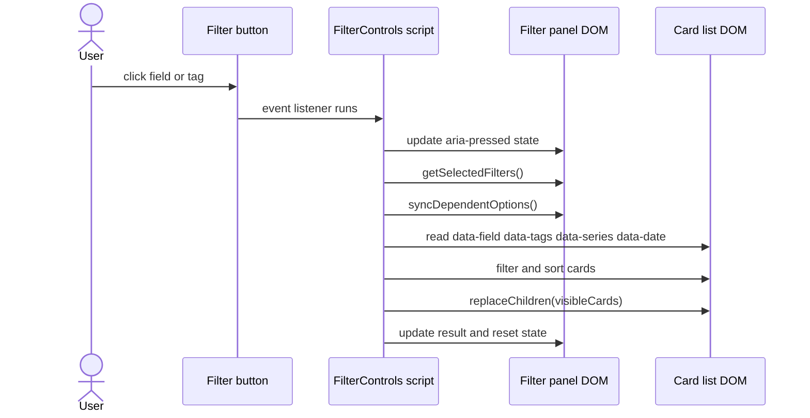
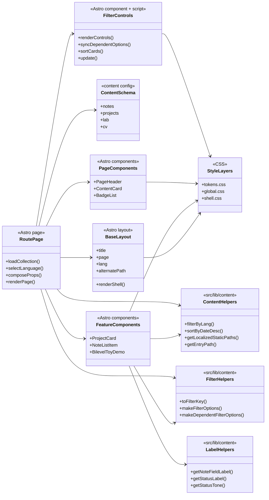

# Astro 프론트엔드 아키텍처

**상태:** 활성 참조 문서  
**작성일:** 2026-07-13  
**범위:** `src/layouts`, `src/pages`, `src/components`, `src/content`, `src/lib`, `src/styles`

## 목적

이 문서는 현재 포트폴리오 Astro 앱의 프론트엔드 구조를 설명한다. 기준은 과거 React/Vite 계획 문서가 아니라 현재 소스 트리다.

이 사이트는 정적 콘텐츠 중심의 Astro 포트폴리오다. 라우트는 `src/pages/**`가 소유하고, 글과 프로젝트 데이터는 Astro content collection으로 관리하며, 재사용 가능한 기능 로직은 `src/lib/**`로 분리한다. `.astro` 파일은 주로 HTML 렌더링과 페이지 조립을 맡고, 클라이언트 JavaScript는 명시적인 상호작용이 필요한 곳에만 둔다.

핵심 원칙은 **기능부와 렌더링부를 분리하되, Astro의 정적 생성 모델을 해치지 않는 것**이다.

## 전체 구조

| 영역 | 대표 경로 | 책임 |
|---|---|---|
| 라우트 | `src/pages/**` | URL 구조, 언어별 페이지, collection 로딩, 페이지 조립 |
| 레이아웃 | `src/layouts/Base.astro` | 문서 shell, 언어 속성, 사이드바, 테마 초기화, 본문 프레임 |
| 콘텐츠 원본 | `src/content/**` | notes, projects, lab, cv Markdown 데이터 |
| 콘텐츠 스키마 | `src/content/config.ts` | frontmatter 타입과 허용 값 |
| 기능부 | `src/lib/**` | 필터 key 정규화, 상태/분야 라벨, 경로 계산, 순수 계산 로직 |
| 렌더링부 | `src/components/**`, `.astro` pages | props 기반 HTML 출력, 카드/배지/필터 UI, 상세 화면 |
| 스타일 | `src/styles/**` | 디자인 토큰, 전역 스타일, shell/component class |

한국어와 영어 페이지는 `/`와 `/en/` 라우트 트리로 나뉜다. 핵심 페이지를 추가하거나 구조를 바꿀 때는 두 언어의 대응 관계를 함께 검토해야 한다.

## 기능부

기능부는 화면 모양을 모른다. 데이터를 정규화하고, 도메인 규칙을 표현하고, 여러 페이지에서 반복되는 계산을 안정적인 함수로 제공한다.

현재 기능부의 중심은 `src/lib/**`다.

| 파일 | 책임 |
|---|---|
| `src/lib/content/collections.ts` | 언어 필터링, 날짜 정렬, slug 정리, localized static paths 생성, entry URL 생성 |
| `src/lib/content/filters.ts` | 필터 key 정규화, 일반 필터 옵션 생성, 부모 필터에 종속된 옵션 생성 |
| `src/lib/content/fields.ts` | notes 분야 순서와 KO/EN 표시 라벨 |
| `src/lib/content/status.ts` | 상태 라벨, 상태 tone, 상태 필터 옵션 |
| `src/lib/lab/bilevelToy.ts` | lab demo에서 쓰는 순수 계산 모델 |

예를 들어 notes 페이지에서 `field`, `series`, `tags` 필터를 만들 때 라우트는 `getCollection('notes')`로 데이터를 가져오지만, tag key 정규화나 field 라벨링 규칙은 직접 구현하지 않는다. `makeDependentFilterOptions()`와 `makeAllNoteFieldFilterOptions()` 같은 기능부 함수를 호출한다.

기능부에 두어야 하는 것:

- collection entry를 언어, 날짜, 상태, 분야 기준으로 고르는 규칙
- `BERT`, `Black-box Optimization` 같은 표시 문자열을 DOM 비교용 stable key로 바꾸는 규칙
- `field -> tags`처럼 한 필터가 다른 필터에 종속되는 관계
- `/en/notes/cma-es/` 같은 라우트 경로 생성
- lab demo처럼 UI와 분리 가능한 수식/계산

기능부에 두지 말아야 하는 것:

- 카드의 HTML 구조
- 버튼 class 이름
- metadata badge 배치
- 모바일/데스크톱 레이아웃
- hover, 색상, 간격 같은 시각 규칙

## 렌더링부

렌더링부는 이미 준비된 데이터를 받아 의미 있는 HTML로 출력한다. 가능한 한 fetch나 collection 탐색을 직접 하지 않고, 라우트 또는 기능부가 넘긴 props를 사용한다.

렌더링부의 중심은 `.astro` 파일이다.

| 영역 | 대표 파일 | 책임 |
|---|---|---|
| 페이지 | `src/pages/notes/index.astro` | collection 로딩, 언어 선택, 필터 옵션 조립, page layout 구성 |
| 상세 페이지 | `src/pages/notes/[slug].astro` | static path 기반 detail 렌더링, Markdown body 출력 |
| 공통 UI | `src/components/ui/PageHeader.astro`, `BadgeList.astro`, `ContentCard.astro` | 반복되는 시각 단위 |
| 기능별 카드 | `src/components/content/NoteListItem.astro`, `src/components/project/ProjectCard.astro` | entry 하나를 카드 형태로 렌더링 |
| 상호작용 UI | `src/components/ui/FilterControls.astro`, `src/components/lab/BilevelToyDemo.astro` | 제한된 클라이언트 동작을 포함한 UI |

예를 들어 `NoteListItem.astro`는 note entry를 받아 제목, 요약, 분야, 시리즈, category, 상태, 태그를 렌더링한다. 동시에 필터 컴포넌트가 읽을 수 있도록 `data-field`, `data-series`, `data-tags`, `data-date` 속성을 카드에 붙인다. 이때 field label 계산은 `getNoteFieldLabel()`을 사용하고, DOM 비교용 key는 `toFilterKey()`를 사용한다.

렌더링부에 두어야 하는 것:

- props를 HTML 구조로 바꾸는 일
- 접근성 속성, semantic tag, metadata badge 출력
- 기존 디자인 시스템 class 적용
- `data-*` 속성처럼 클라이언트 상호작용과 연결되는 표면

렌더링부에 두지 말아야 하는 것:

- 여러 페이지에서 재사용될 필터 옵션 생성 규칙
- slug/language path 계산의 중복 구현
- 콘텐츠 schema에 가까운 도메인 제약
- UI와 무관한 수식/모델 계산

## 상호작용부

기본 정책은 zero client JavaScript다. 정적 HTML로 충분한 화면은 클라이언트 코드를 추가하지 않는다.

현재 허용된 예외는 다음과 같다.

- `Base.astro`: 초기 테마 적용과 sidebar 상태 유지
- `ThemeToggle.astro`: 테마 전환
- `FilterControls.astro`: index page의 필터링, 정렬, 종속 필터 옵션 숨김 처리
- `BilevelToyDemo.astro`: 브라우저에서만 필요한 slider demo

`FilterControls.astro`는 렌더링부와 상호작용부가 만나는 컴포넌트다. Astro가 먼저 버튼과 카드 목록을 정적 HTML로 렌더링하고, 작은 inline script가 `data-filter-*`와 `data-*` 속성을 읽어 DOM을 갱신한다.

상호작용이 커지는 경우에는 다음 기준으로 분리한다.

- 여러 페이지에서 같은 동작이 반복되면 script를 별도 모듈로 분리한다.
- `field -> series -> tags`처럼 종속 관계가 깊어지면 순수 필터 계산을 `src/lib/**`로 옮긴다.
- URL query 동기화가 필요해지면 route/state 규칙을 먼저 정의한다.
- 검색, pagination, remote API가 필요해지면 정적 Astro 구조로 충분한지 다시 판단한다.

## 라우트 구조

| 페이지 | 한국어 | 영어 | 데이터 |
|---|---|---|---|
| Home | `/` | `/en/` | page-local |
| About | `/about/` | `/en/about/` | page-local |
| Projects index | `/projects/` | `/en/projects/` | `projects` collection |
| Project detail | `/projects/[slug]/` | `/en/projects/[slug]/` | `projects` collection |
| Notes index | `/notes/` | `/en/notes/` | `notes` collection |
| Note detail | `/notes/[slug]/` | `/en/notes/[slug]/` | `notes` collection |
| Lab index | `/lab/` | `/en/lab/` | `lab` collection |
| Lab detail | `/lab/[slug]/` | `/en/lab/[slug]/` | `lab` collection |
| CV | `/cv/` | `/en/cv/` | `cv` collection |

동적 상세 라우트는 `getStaticPaths()`로 빌드 시점에 생성된다. `getLocalizedStaticPaths()`는 언어 필터링, slug prefix 제거, props mapping을 공통화한다.

## 연결 흐름

기능부와 렌더링부는 다음 순서로 연결된다.



notes index를 기준으로 보면 흐름은 더 구체적이다.

1. `src/content/notes/**`의 Markdown frontmatter가 `notes` collection entry가 된다.
2. `src/content/config.ts`가 `field`, `series`, `tags`, `status` 같은 metadata 형태를 검증한다.
3. `src/pages/notes/index.astro`가 `getCollection('notes')`로 entry를 가져오고 `filterByLang()`과 `sortByDateDesc()`를 적용한다.
4. 같은 페이지가 `makeAllNoteFieldFilterOptions()`, `makeFilterOptions()`, `makeDependentFilterOptions()`로 필터 옵션을 만든다.
5. `FilterControls.astro`는 옵션을 버튼으로 렌더링한다. `dependsOn: 'field'`가 있는 태그 그룹은 `data-filter-parent-values`를 함께 출력한다.
6. `NoteListItem.astro`는 각 노트 카드를 렌더링하고 `data-field`, `data-series`, `data-tags`, `data-date`를 붙인다.
7. 브라우저에서는 `FilterControls.astro`의 작은 script가 선택된 버튼과 카드의 `data-*`를 비교해서 목록을 갱신한다.

이 구조의 장점은 화면 HTML과 도메인 규칙이 강하게 엉키지 않는다는 점이다. 필터 key 생성 규칙을 바꾸려면 `src/lib/content/filters.ts`를 보면 되고, 카드 표시 방식을 바꾸려면 `NoteListItem.astro`를 보면 된다.

## 대표 컴포넌트 다이어그램

하나의 `.astro` 파일 안에 렌더링부와 기능부가 함께 있는 경우에는 한 종류의 다이어그램만으로 설명하지 않는다. `FilterControls.astro`처럼 HTML 렌더링과 inline script가 같이 있는 컴포넌트는 다음 세 관점으로 나누어 읽는 편이 좋다.

- `flowchart`: 데이터가 어떤 순서로 HTML과 script까지 흘러가는지 보여준다.
- `classDiagram`: 한 파일 내부의 책임 구획과 DOM contract를 보여준다.
- `sequenceDiagram`: 사용자가 클릭했을 때 실제 실행 순서를 보여준다.

### Flowchart: 데이터와 DOM 연결



이 그림은 정적 생성 흐름을 설명한다. route page가 collection을 읽고 필터 옵션을 만들면, `FilterControls.astro`는 버튼을 만들고 `NoteListItem.astro`는 카드의 `data-*` contract를 만든다. 브라우저에서는 작은 script가 그 정적 HTML을 읽고 갱신한다.

### Class Diagram: 파일 내부 책임 분리

```mermaid
classDiagram
  direction TB

  class FilterControlsAstro {
    <<Astro file>>
    Props label scope groups sort
    Renders filter panel and chips
    Emits data-filter attributes
  }

  class RenderingPart {
    <<rendering part>>
    +renderFilterGroups()
    +renderSortControls()
    +renderEmptyMessage()
  }

  class InteractionPart {
    <<inline script>>
    +setupFilterControls(root)
    +getSelectedFilters()
    +syncDependentOptions(selected)
    +cardMatches(card, selected)
    +sortCards()
    +update()
  }

  class FilterOptionData {
    <<input data>>
    value
    label
    tone
    parentValues
  }

  class FilterableCards {
    <<DOM contract>>
    data-field
    data-tags
    data-series
    data-date
  }

  FilterControlsAstro *-- RenderingPart
  FilterControlsAstro *-- InteractionPart
  RenderingPart --> FilterOptionData
  RenderingPart --> FilterableCards : writes contract
  InteractionPart --> FilterableCards : reads and updates
  InteractionPart --> FilterOptionData : uses parentValues
```



이 그림은 실제 class 구조를 뜻하지 않는다. 목적은 하나의 파일 내부에 있는 책임을 읽기 쉽게 나누는 것이다. 현재는 `FilterControls.astro` 하나 안에 두어도 충분하지만, script가 커지면 `RenderingPart`는 `.astro`에 남기고 `InteractionPart`나 순수 필터 계산은 별도 파일로 분리할 수 있다.

### Sequence Diagram: 필터 클릭 실행 순서



이 그림은 런타임 동작을 설명한다. 사용자가 누른 것은 버튼 하나지만, script는 선택 상태를 갱신하고, 종속 태그 옵션을 숨기거나 되돌리고, 카드의 `data-*` 값을 비교한 뒤 목록을 다시 배치한다.

## 클래스 관계



## 확장 규칙

새 route를 추가할 때:

1. 한국어와 영어 route를 함께 추가한다. 미루는 경우에는 이유를 문서화한다.
2. collection 로딩은 route page에서 시작한다.
3. 반복되는 데이터 변환은 `src/lib/**`로 옮긴다.
4. 렌더링은 기존 `src/components/ui/**` primitive를 먼저 사용한다.
5. 새 상호작용은 정적 HTML + 작은 script로 충분한지 먼저 확인한다.
6. `npm run lint`와 `npm run build`를 실행한다.

새 content metadata를 추가할 때:

1. `src/content/config.ts` schema를 먼저 수정한다.
2. KO/EN 표시 라벨이 필요하면 `src/lib/content/**`에 둔다.
3. 목록 필터에 쓰이면 stable key를 `toFilterKey()` 기준으로 맞춘다.
4. 카드에 필요한 `data-*` 속성을 렌더링 컴포넌트에 추가한다.
5. 상세 페이지와 목록 페이지의 metadata 표시를 함께 확인한다.

새 상호작용을 추가할 때:

1. 서버에서 정적으로 해결할 수 있는지 먼저 판단한다.
2. 브라우저 상태가 필요하면 해당 컴포넌트 내부에 격리한다.
3. DOM 비교에는 표시 텍스트가 아니라 정규화된 `data-*` key를 사용한다.
4. 동작이 커지면 script 모듈 또는 순수 함수로 분리한다.

## 검증 기준

문서와 구현이 어긋나지 않도록 다음 명령을 기본 검증으로 사용한다.

```bash
npm run lint
npm run build
```

상호작용을 바꾼 경우에는 가능하면 브라우저에서 직접 확인한다. 특히 필터, 정렬, theme, lab demo는 빌드 통과만으로 사용자 동작이 검증됐다고 보지 않는다.
