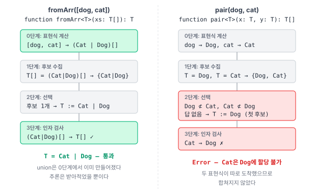

---
# Recommended paths:
# - src/content/notes/ko/<field>/<slug>.md
# - src/content/notes/en/<field>/<slug>.md
title: "How is a type argument determined?"
lang: "en"
translationKey: "type-argument-inference"
date: "2026-07-27"
# field: "web" | "game" | "programming-language" | "ai"
field: "programming-language"
category: "typescript"
series: "javascript/typescript"
# status: "draft" | "reading" | "implemented" | "stable"
status: "implemented"
summary: "How the compiler solves for T when the type argument is omitted in a generic call, and why inference fails when candidates conflict."
problem: "How is T determined when the type argument is omitted, and why does passing Dog and Cat not get merged into Animal?"
coreIdea: "TypeScript gathers candidates only from positions where T actually appears, and creates new types only where the composition rule is unique."
connection: "type inference, unification, structural typing, infer"
tags: ["typescript", "javascript"]
---

# Inference and unification

## Problem

In the [previous post](/en/notes/ts-generics) we defined generic functions, yet when calling them we never wrote a type argument.

```ts
function identity<T>(x: T): T { return x; }

const explicit = identity<string>("hi"); // explicit
const inferred = identity("hi");         // T was not written
```

The second call behaves identically. That means the compiler worked out `T`.

The type inference covered in the earlier post computed a variable's type from its initializer and context. Inference in generics is a little different in character. Here it is closer to **solving for an unknown**.

> By what procedure does the compiler determine the value of `T`, and when does that procedure fail?

## 0. Unification

Here is what happens in `identity("hi")`.

```
declared parameter type:  T
actual argument type:     "hi"
        │
        │ match the two expressions
        ▼
T := "hi"
```

Matching two type expressions containing an unknown in order to solve for that unknown is called **unification**.

When `T` appears in several positions, one **candidate** is gathered from each.

```ts
function pair<T>(x: T, y: T): T[] { return [x, y]; }

pair("a", "b"); // candidates = { "a", "b" } → T := string
```

### 0.1 A parameter type is a pattern

If we are solving an equation, the answer depends on where the unknown is planted. Writing the parameter type as `T` and writing it as `T[]` are different equations.

```ts
declare function fA<T>(xs: T[]): T;
declare function fB<T>(xs: T): T;

fA([dog, cat]); // Cat | Dog
fB([dog, cat]); // (Cat | Dog)[]
```

Both compile fine. What differs is what `T` binds to.

```
fA:  T[]  =  (Cat | Dog)[]    →  strip the [] from both sides  →  T = Cat | Dog
fB:  T    =  (Cat | Dog)[]    →  as-is                         →  T = (Cat | Dog)[]
```

Writing `T[]` is a declaration that "**the argument will be an array, and I will call its element type `T`**." Planting the unknown inside the structure **decomposes and extracts** it. Writing just `T` takes the whole thing without decomposition.

![T[] decomposes and extracts, T takes the whole thing|520](inference-pattern.svg "T[] strips off the array structure to extract the element type, while T takes the whole thing as-is. For the same argument, the answer depends on where the unknown is planted.")

That is why a function meaning to return an element has to be written with `T[]`.

```ts
function bodyA<T>(xs: T[]): T { return xs[0]!; } // OK

function bodyB<T>(xs: T) {
  return xs[0]; // Error — we cannot even know whether T is indexable
}
```

With `xs: T`, `T` could be any type, so indexing is not allowed — the signature never says it is an array. The parametricity from the [previous post](/en/notes/ts-generics) is at work here too.

This view corresponds exactly to `infer`, which we will cover later.

```ts
xs: T[]                              // value level: extract T from the T[] pattern
T extends Promise<infer U> ? U : T   // type level: extract U from the Promise<U> pattern
```

Signatures like `T[]`, `Map<K, V>`, and `(x: T) => R` are all patterns saying **"it will look like this, so please name that piece for me."** Where you put the generic variable within the parameter type is exactly what determines what gets extracted.

The rules by which `infer` extracts a piece are continued in the post on conditional types. This post focuses on value-level inference.

## 1. What happens when candidates conflict

Consider the following code.

```ts
pair("a", 1); // Error!
// Argument of type 'number' is not assignable to parameter of type 'string'
```

TypeScript does **not merge** the type candidates. It picks one **from among** the gathered candidates. The criteria for picking are **1) a candidate that can accept all the others**, i.e. a supertype of the rest, and **2) the order in which the types appear**.

`string` and `number` cannot accept each other, so criterion 1 yields no answer, and criterion 2 fixes it to **the first candidate, `string`**. The error message saying "parameter of type `string`" is the evidence. Swapping the argument order changes the result accordingly.

```ts
pair("a", 1); // parameter of type 'string'  → T := string
pair(1, "a"); // parameter of type 'number'  → T := number
```

So what failed here is not fixing `T`, but **the assignment check on the second argument**.

Here is an example that reveals criterion 1.

```ts
class Animal { a = 1 }
class Dog extends Animal { d = 1 }

const A1 = pair(new Animal(), new Dog()); // Animal[]
const B1 = pair(new Dog(), new Animal()); // Animal[]
```

If rule 2 applied first, `B1` should have been fixed to `Dog` and failed. That both results are the same means **the top of the candidate set is sought first**.

> [!warning] As noted above, order intervenes when several candidates are equally qualified.

In the example above there was exactly one qualified candidate, `Animal`. If several candidates can all accept one another, any of them is safe to pick, and in that case the later candidate is chosen.

```ts
class DogB extends Animal { c = 2 }
class CatB extends Animal { c = 1 }
// the two classes are structurally identical, so they are mutually assignable

pair(new DogB(), new CatB()); // CatB[]
pair(new CatB(), new DogB()); // DogB[]
```

The principle "relationship is the criterion" holds, but **the tie-break when scores are equal is an implementation detail**. Either pick makes no difference to type safety.

> [!tip] In fact, in the code above `DogB` and `CatB` are the same type under different names.

Let me note the two situations where order intervenes so they are not confused. They run in opposite directions.

| Situation | Result |
|---|---|
| **No** qualified candidate | fix to the **first** candidate, then fail during argument checking |
| **Several** qualified candidates | the **later** candidate is chosen, and it passes |

## 2. But why do Dog and Cat fail?

Now the central case.

```ts
class Animal { a = 1 }

class Dog extends Animal { d = 1 }
class Cat extends Animal { c = 1 }

pair(new Dog(), new Cat()); // Error
```

`Dog` and `Cat` both extend `Animal`. A common supertype clearly exists, and yet inference fails.

There are two reasons.

### 2.1 Animal is never registered as a candidate

Candidates are gathered only from **positions where `T` actually appears**. What came in as arguments was only `Dog` and `Cat`; `Animal` appears nowhere in the code.

$$
\text{candidate set} = \{\text{Dog}, \text{Cat}\}
$$

`Dog` cannot accept `Cat` and `Cat` cannot accept `Dog`. There is no answer inside the set.

`Animal` did not lose the competition among type candidates — **it was never registered as a candidate at all**.

One thing must be made clear here. Candidate collection **does not judge** "which type is appropriate." It merely transcribes the type of the expression in that position. The following code confirms it.

```ts
const a: Animal = new Dog();
const b: Animal = new Cat();

pair(a, b); // Animal[] — passes
```

The values entering at runtime are still `Dog` and `Cat`. But because the **declared types** of `a` and `b` are `Animal`, the candidate set becomes `{Animal, Animal}` and an answer exists. Changing only one side works the same way.

```ts
const c: Animal = new Dog();

pair(c, new Cat()); // Animal[] — candidate set is { Animal, Cat }
```

So what collection sees is neither the value nor its suitability — only **the type written on the expression**.

The supporting evidence is the code below: `pair<Animal>(...)` passes.

```ts
pair<Animal>(new Dog(), new Cat()); // OK
```

If `Animal` had been judged inappropriate and eliminated from type determination, specifying it explicitly should also be rejected. That the code above passes means it was **non-registration, not elimination**.

### 2.2 So why not bring it in from outside?

Then why doesn't TypeScript fetch `Animal` on its own? Here is a decisive clue.

```ts
declare const dog: Dog, cat: Cat;

const arr = [dog, cat];   // (Cat | Dog)[]  ← a union was created
pair(dog, cat);           // Error          ← it fails
```

<details>
<summary>How to type-check arr</summary><br/>

The `(Cat | Dog)[]` in the comment is only a claim, so let us verify it in code by squeezing from both directions.

```ts
const arr = [dog, cat];

const ok: (Dog | Cat)[] = arr;  // OK   — it is assignable to this type
const no1: Dog[] = arr;         // Error — it is not Dog[]
const no2: Cat[] = arr;         // Error — nor Cat[]
```

Looking at what can be done with the elements makes it clearer.

```ts
arr[0].a;       // OK    — a member Dog and Cat have in common
arr[0].bark();  // Error — only Dog has it
arr[0].meow();  // Error — only Cat has it
```

**"Types union, available operations intersect"** from the [previous post](/en/notes/ts-type-check) appears verbatim. Since the element is `Dog | Cat`, only the intersection of the two types is accessible.

> [!tip] How to check an inferred type

Hovering over the variable in the editor is fastest, but if you want it recorded in code, squeeze with **bidirectional assignment** as above, or emit a `.d.ts` with `tsc --declaration --emitDeclarationOnly`. Every type annotation in this post was verified the latter way.

```
$ tsc --declaration --emitDeclarationOnly example.ts
$ cat example.d.ts
declare const arr: (Cat | Dog)[];
```

</details>

**The same two types placed side by side, and the results diverge.** Above, `Cat | Dog` was created perfectly well; below, nothing was created at all.

The reason for the difference is that **these two happen at different stages**.

```ts
function fromArr<T>(xs: T[]): T { return xs[0]!; }

const exprArr = [dog, cat];         // (Cat | Dog)[]  ← the type of the expression itself
const viaArr = fromArr([dog, cat]); // T := Cat | Dog ← passes
```

`[dog, cat]` becomes a union **when the type of the array literal expression is computed**. That computation finishes before generic inference and is then fed into it. So by the time `fromArr` receives its candidate for `T`, it is already **a single type**, `(Cat | Dog)[]`, and the candidate set has exactly one element.

```
fromArr([dog, cat])                    pair(dog, cat)
        │                                     │
        │ expression typing                   │ expression typing
        ▼                                     ▼
   (Cat | Dog)[]                          Dog,  Cat
        │                                     │
        │ candidate collection                │ candidate collection
        ▼                                     ▼
   candidates = { Cat | Dog }            candidates = { Dog, Cat }
        │  one element                         │  two elements
        ▼                                     ▼
   T := Cat | Dog                        cannot choose → Error
```



So inference did not merge the candidates; it **merely transcribed an already-merged result**. Conditional expressions behave the same way.

```ts
const exprCond = cond ? dog : cat;  // Cat | Dog  ← already complete here
pair(exprCond, exprCond);           // one candidate, Cat | Dog → passes
```

Passing the same `dog` and `cat`, **making them one lump at the expression stage passes, and passing them separately fails.** What makes the difference is not the content of the types but how many candidates arrive.

### 2.3 At which stage are new types created?

Seen this way, the whole procedure of inference comes into view.

```
stage 0  compute the types of expressions   ← new types are created only here
stage 1  candidate collection — transcribe the computed types
stage 2  selection — pick from among the candidates   ← creates nothing new
stage 3  argument checking — recheck each argument against the fixed T
```

This section covers stages 0–2. Stage 3 and the role of constraints continue in section 3.

Every place a new type is created belongs to stage 0.

| Position | Rule | Example |
|---|---|---|
| array literal | union of the elements | `[dog, cat]` → `(Cat \| Dog)[]` |
| conditional expression | union of the two branches | `cond ? dog : cat` → `Cat \| Dog` |
| multiple `return`s | union of the returns | `Cat \| Dog` |

> [!tip] Widening when passing literals

When literals are mixed in, as in `["a", 1]`, the elements are widened to `string` and `number` before being merged. That widening is a separate rule covered in the earlier post, and it does not apply in the generic type argument position (`identity("hi")` → `"hi"`).

### 2.4 And so it fails

The `T` in `pair<T>` must be **fixed to a single type**. But the candidate set `{Dog, Cat}` contains no candidate able to accept the rest, and the selection stage creates no new types. So it fails.

That is the answer to "why does it fail?"

> [!tip] Then why that rule?

An obvious follow-up remains. Wouldn't supplying either `Animal` or `Dog | Cat` do the job? And indeed, specifying either explicitly passes.

```ts
pair<Animal>(new Dog(), new Cat());    // OK
pair<Dog | Cat>(new Dog(), new Cat()); // OK
```

So TypeScript **knows a safe answer and declines to produce it**. Why that rule was chosen is a question of language design rather than of the inference algorithm, so it is covered in a separate post.

### 2.5 An aside: `infer` is the exception

There is one exception to the conclusions so far. It is off the main thread but used later, so let us note it. In conditional types, `infer` has no expression at all, and yet when several candidates share a name they **really are merged**.

```ts
type CoV<T> = T extends { x: infer U; y: infer U } ? U : never;

type I1 = CoV<{ x: Dog; y: Cat }>; // Dog | Cat
```

What matters is the implication this exception leaves. **The same compiler can merge candidates in `infer`.** So not merging them in a function call is not a limit of capability.

The rules by which `infer` merges candidates, and why it appeared in the first place, are covered in a separate post dealing properly with conditional types.

## 3. When do constraints intervene?

Finally, let us see where `T extends X` fits into this procedure.

```ts
class Animal { a = 1 }
class Dog extends Animal { d = 1 }
class Puppy extends Dog { p = 1 }
declare const animal: Animal, dog: Dog, puppy: Puppy;

declare function f<T extends Dog>(x: T, y: T): T[];

const r1 = f(puppy, puppy);   // Puppy[]
const r2 = f(puppy, dog);     // Dog[]
const r3 = f(puppy, animal);  // Dog[]  ← Error, and yet T is Dog
```

From `r1`, when a candidate satisfies the constraint, **that candidate is used as-is**. Having a constraint does not mean it unconditionally falls back to the constraint.

The problem is `r3`. The candidates are `{Puppy, Animal}`, and `Animal` violates the constraint `Dog`. Two hypotheses can be proposed.

| Hypothesis | Prediction |
|---|---|
| The constraint **filters** candidates → `Animal` excluded → remaining `Puppy` chosen | `Puppy[]` |
| Selection proceeds unchanged and **the result is corrected** → topmost `Animal` chosen → violation → falls back to the constraint | `Dog[]` |

The actual result is `Dog[]`. **Constraints do not filter candidates.** `Animal` did not drop out of the competition; it won and was then swapped out for violating the constraint.

Lowering the constraint as a confirming shot makes it clear.

```ts
declare function g<T extends Animal>(x: T, y: T): T[];

const r4 = g(puppy, animal);  // Animal[] — if the topmost satisfies the constraint, it is used as-is
```

### 3.1 Marking the constraint's place in the procedure

```
stage 0  compute the types of expressions
stage 1  candidate collection  — transcription only
stage 2  selection             — pick the topmost candidate (constraints do not participate here)
        └ correction           — if the pick violates the constraint, fall back to the constraint itself   ← constraints act here
stage 3  argument checking     — recheck each argument against the fixed T                                 ← most errors happen here
```

The same correction operates when nothing could be picked from the candidates.

```ts
declare function h<T extends Dog>(): T[];

const r5 = h();  // Dog[] — with no position to infer from, the constraint becomes T
```

Without a constraint it falls back to `unknown`.

```ts
declare function h2<T>(): T[];

const r6 = h2();  // unknown[]
```

So **a constraint doubles as T's default**. When the candidates yield no answer, or the answer they yield falls outside the constraint, the constraint fills the slot.

Most errors we run into arise at stage 3. That is, **it is not the candidate that is eliminated but the argument**. Even in `r3`, `T` was safely fixed to `Dog`, and the error came afterward, from trying to put `animal` into a `Dog` slot.

## 4. Conclusion

```
Unification
→ Match a type expression containing an unknown against an actual type to solve for the unknown.

A parameter type is a pattern
→ T and T[] are different equations. Where the unknown is planted determines what gets extracted.
→ To return an element you must write T[]. With T you cannot even index.

The four stages of inference
→ expression typing → candidate collection → selection → argument checking
→ New types are created only at stage 0, and constraints correct the result of stage 2.
→ Most errors arise at stage 3; it is the argument that is eliminated, not the candidate.

Candidate collection does not judge
→ It merely transcribes the type written on the expression.
→ Changing only the declared type to Animal lets the same values pass.
→ Animal was not eliminated; it never entered the contest.

Candidate selection
→ Pick the candidate that can accept all the others. The criterion is relationship, not order.
→ But when several candidates are equally qualified, the tie-break is an implementation detail.

At which stage are new types created?
→ Only in the stage that computes expression types (array literals, conditional expressions, multiple returns).
→ Collection and selection only transcribe and pick from already-computed types; they create nothing.
→ [dog, cat] becoming a union is array literal typing, not inference.

infer is the one exception
→ It merges same-named candidates even with no expression present.
→ So not merging them in a function call is not a matter of capability.

Why not bring in the common supertype?
→ Animal is not a candidate, and the selection stage creates no new types. So it fails.
→ Yet specified explicitly, both Animal and Dog|Cat pass. It knows a safe answer and declines to produce it.
→ Why that rule exists is a design question, covered in the next post.

Where constraints sit
→ They do not filter candidates. Selection proceeds independently of them.
→ If the pick falls outside the constraint, it falls back to the constraint (correction).
→ So a constraint also doubles as T's default. Without one, it falls back to unknown.
```

In one sentence:

> TypeScript transcribes candidates only from positions where T actually appears, and when no answer exists among them — even if a safe answer exists outside, unless it is unique — it chooses failure over guessing.

## Full code

The code in this post, collected into a single file. Lines expected to error carry `@ts-expect-error`, so you can check that the whole thing passes under `tsc --strict`.

```ts
// ── § Unification ───────────────────────────────────

function identity<T>(x: T): T { return x; }

const explicit = identity<string>("hi");
const inferred = identity("hi");

function pair<T>(x: T, y: T): T[] { return [x, y]; }

pair("a", "b");

// ── § A parameter type is a pattern ─────────────────

class Animal { a = 1 }
class Dog extends Animal { d = 1 }
class Cat extends Animal { c = 1 }

declare const dog: Dog, cat: Cat;

declare function fA<T>(xs: T[]): T;
declare function fB<T>(xs: T): T;

fA([dog, cat]); // Cat | Dog
fB([dog, cat]); // (Cat | Dog)[]

function bodyA<T>(xs: T[]): T { return xs[0]!; }
function bodyB<T>(xs: T) {
  // @ts-expect-error — we cannot know whether T is indexable
  return xs[0];
}

// ── § Candidate conflict ────────────────────────────

// @ts-expect-error
pair("a", 1);

const A1 = pair(new Animal(), new Dog()); // Animal[]
const B1 = pair(new Dog(), new Animal()); // Animal[]

class DogB extends Animal { c = 2 }
class CatB extends Animal { c = 1 }

pair(new DogB(), new CatB()); // CatB[]
pair(new CatB(), new DogB()); // DogB[]

// ── § Why do Dog and Cat fail? ──────────────────────

// @ts-expect-error
pair(new Dog(), new Cat());

const a: Animal = new Dog();
const b: Animal = new Cat();
pair(a, b); // Animal[]

const c: Animal = new Dog();
pair(c, new Cat()); // Animal[]

pair<Animal>(new Dog(), new Cat()); // OK

// ── § Expression typing vs candidate collection ─────

declare function fromArr<T>(xs: T[]): T;

const exprArr = [dog, cat];
const viaArr = fromArr([dog, cat]); // T := Cat | Dog

const cond = Math.random() > 0.5;
const exprCond = cond ? dog : cat;
pair(exprCond, exprCond);

pair<Dog | Cat>(new Dog(), new Cat()); // OK

// ── § The infer exception ───────────────────────────

type CoV<T> = T extends { x: infer U; y: infer U } ? U : never;
type I1 = CoV<{ x: Dog; y: Cat }>; // Dog | Cat

// ── § Constraints ───────────────────────────────────

class Puppy extends Dog { p = 1 }
declare const animal: Animal, puppy: Puppy;

declare function f<T extends Dog>(x: T, y: T): T[];

const r1 = f(puppy, puppy);  // Puppy[]
const r2 = f(puppy, dog);    // Dog[]
// @ts-expect-error
const r3 = f(puppy, animal); // Error

declare function g<T extends Animal>(x: T, y: T): T[];
const r4 = g(puppy, animal); // Animal[]

declare function h<T extends Dog>(): T[];
const r5 = h(); // Dog[]

declare function h2<T>(): T[];
const r6 = h2(); // unknown[]
```

## Connections

- Next question to check: why does TypeScript decline to produce a safe answer it knows? The same kind of choice appears in arrays and methods.
- A later question: how to **ask conditions about** a type, and by what rules `infer` extracts a piece → "Asking conditions of a type: conditional types and infer"
