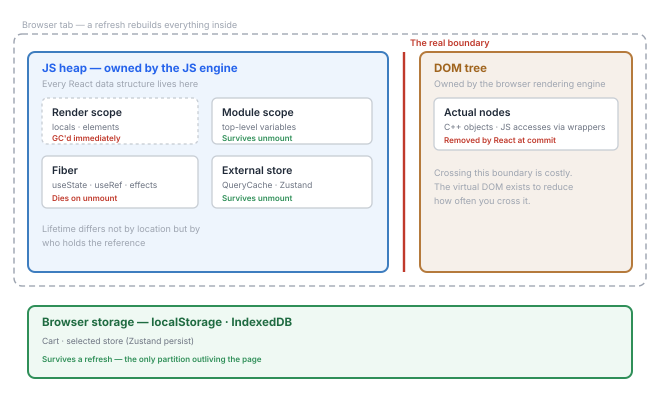
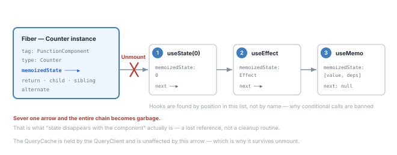
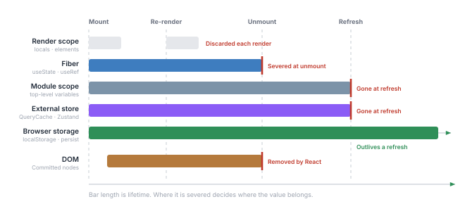

---
# Recommended paths:
# - src/content/notes/ko/<field>/<slug>.md
# - src/content/notes/en/<field>/<slug>.md
title: "React Has No Memory of Its Own"
lang: "en"
translationKey: "react-memory-partitions"
date: "2026-08-09"
# field: "web" | "game" | "programming-language" | "ai" | "blog"
field: "web"
category: "react"
series: "Moment Coffee"
order: 4
# status: "draft" | "reading" | "implemented" | "stable"
status: "reading"
summary: "It started with one sentence — \"the data does not travel through Context.\" I assumed React had a memory layer of its own. What it actually has is not physical separation but lifetime partitions."
problem: "Where exactly does state live in a React app? Why does the cache survive a tab switch but vanish on refresh?"
coreIdea: "Physically it is all one JS heap. There is exactly one real boundary — between the JS heap and the DOM — and everything else is a logical partition divided by lifetime. Deciding where to put state is deciding which partition it belongs to."
connection: "Fiber, JS heap, lifetime partitions, garbage collection, state ownership"
tags: ["react", "fiber", "memory", "state-management", "moment-coffee"]
---

# React Has No Memory of Its Own

## 1. One sentence caught my eye

While working out where TanStack Query's cache lives in [part 3](/en/notes/server-state-as-cache/), I ran into this explanation:

> What `QueryClientProvider` passes down through Context is only the client instance — **the data does not travel through Context.**

It made sense. Putting data directly into Context re-renders the entire subscribing tree, so passing down only the address and letting each hook subscribe on its own is the reasonable design.

But the sentence stuck. **If the data doesn't travel through Context, where does it travel?**

Context is a channel React provides. Not using that channel means going outside React — and I couldn't picture where exactly "outside React" was.

## 2. So here was my guess

> React must have **a memory layer of its own** that I don't know about. `useState` lives there, and library caches live in ordinary memory outside it.

There were reasons this felt plausible.

- `useState` **disappears when the component does.** Its lifetime differs from an ordinary variable's
- Use the same component twice and the state is **tracked independently.** Something is keeping per-instance slots
- Meanwhile the QueryCache **survives** even after a component unmounts

Different lifetimes, I figured, must mean different places. And I assumed the name of that "React-only space" was the **virtual DOM** — it was the only thing I knew React kept on its own.

> [!note] Status of this note
> This is a conceptual write-up. React's internal data structures are **implementation details** and can change between versions. Use them as a model for understanding behavior, not as something your code depends on. (Based on React 18–19.)

---

## 3. What's actually there

### 3.1 Physically, it's all one thing

Half the guess collapses right away. **There is no React-only memory region.**

Elements, Fibers, the Zustand store, the QueryCache — all of them are **ordinary objects in the same JS heap.** No special allocator, no isolated region.

The browser has exactly **one** real boundary.



| Region | Owner | Contents |
|---|---|---|
| **JS heap** | JS engine | Objects, closures, arrays. **Every** React data structure |
| **DOM tree** | Browser rendering engine | Actual nodes. JS reaches them through wrapper objects |

This boundary is real. DOM nodes are C++ objects owned by the browser engine, and touching them from JS means passing through bindings. **That is why the virtual DOM exists** — compute inside the JS heap first, cross the boundary as rarely as possible.

But this isn't a boundary between React and everything else. It's a boundary between **all of JS and the DOM**.

### 3.2 So where does `useState` live? Fiber.

The other half of the guess is wrong too. **It isn't the virtual DOM.**

```
JSX                <App />
  ↓ compile
React element      { type: App, props: {...}, key: null }
  ↓ reconciliation
Fiber tree         { tag, memoizedState, child, return, ... }   ← here
  ↓ commit
DOM node
```

Elements (the virtual DOM) are **created fresh on every render and thrown away.** They're immutable and single-use. They can't hold anything.

State lives one layer below, in the **Fiber** — an internal object React keeps one of per component instance, and which **survives between renders.**

| | React element | Fiber |
|---|---|---|
| What it is | A description of what to render | A unit of work + instance state |
| Lifetime | **Single-use** | **Persistent** |
| Holds | type, props, key | + hooks, effects, DOM references |
| Created by | My code (JSX) | React internals |

More precisely, `useState` values sit in the **hook linked list** that `fiber.memoizedState` points to.

```
fiber.memoizedState
  → Hook { memoizedState: 0,      next }   ← useState(0)
  → Hook { memoizedState: [deps], next }   ← useEffect
  → Hook { memoizedState: {...},  next: null }
```

When a component unmounts, its fiber is discarded and the hook list hanging off it becomes garbage too. **That is what "state disappears with the component" actually is.**



The diagram shows two things at once: that **hooks are found by position** (①②③), and that **state disappearing is a lost reference, not a cleanup routine.**

### 3.3 So the real answer is lifetime partitions

There's no "React-only memory," but **partitions with different lifetimes genuinely exist.** Not physical separation — a difference in **who holds a reference, and for how long.**

| Partition | Contents | On unmount | On refresh |
|---|---|---|---|
| Render scope | Component locals, element objects | GC'd immediately | — |
| **Fiber** | `useState` `useRef` effects memo | **Gone** | Gone |
| Module scope | Top-level variables in imported modules | Survives | Gone |
| **External store** | Zustand store, QueryCache | **Survives** | Gone |
| **Browser storage** | localStorage, IndexedDB | Survives | **Survives** |
| DOM | Committed nodes | Removed by React | Gone |

Everything I'd sensed as "living somewhere else" turned out to be different rows of this one table.

Laying the same thing on a time axis makes the comparison more direct.



One more thing surfaces here. **Module scope and the external store have bars of the same length.** The external store isn't a special storage device — it's just **an ordinary object outside the fiber.**

---

## 4. Where the guess broke

To summarize:

| Guess | Reality |
|---|---|
| There's a React-only memory region | **There isn't.** It's all the same JS heap |
| That region is called the virtual DOM | **It's the Fiber.** The virtual DOM is single-use and can hold nothing |
| Different lifetimes mean different locations | **The arrow points the other way.** Lifetime isn't determined by location — **whoever holds the reference determines the lifetime** |

The last one is the crux. I thought things were "managed specially because they sit in a special place." In fact it was entirely about **who is holding on to an ordinary object.**

### Three behaviors explained by one table

**The cache survives switching tabs and coming back**
→ The QueryCache is held by the `QueryClient` instance, which sits outside the fiber. Unmounting a component doesn't sever that reference.

**A refresh wipes the cache**
→ A fresh page means a fresh JS heap. An external store is still just memory.

**A refresh does *not* wipe the cart**
→ Zustand's `persist` pushed the value down into the **browser storage** partition. That's outside the JS heap, so it outlives the page.

### Leaks split here too

**Fibers are cleaned up on unmount; nobody cleans up an external store.**

That's why TanStack Query has `gcTime` — entries whose subscribers are gone must be **explicitly discarded.** Piling caches into module scope indefinitely carries the same risk.

---

## 5. Consequences — how to decide where state goes

Once this table is in place, placing state stops being a matter of taste. The question collapses into one:

> **How long does this value need to live?**

The state ownership table in [Moment Coffee](/en/notes/tenant-split-frontend-backend/) turned out to be an application of exactly this partitioning.

| State | Partition | Why |
|---|---|---|
| Search text, sheet open | **Fiber** (local state) | Meaningless once you leave the screen |
| Menus · stores · orders | **External store** (QueryCache) | The original is on the server, reused across screens |
| Cart · selected store | **Browser storage** (Zustand persist) | Must survive the round trip to the payment gateway |

The third one became clear. Coming back from checkout means the page loads fresh — which is **the event of the entire JS heap being rebuilt.** To survive it, the value has to live outside the heap. The decision wasn't "let's use localStorage"; it was **"this value must outlive the page."**

Conversely, the same table explains why there's no reason to put the menu cache in localStorage. The original is on the server, so fetching again is enough — and more accurate anyway.

---

## 6. The next question

The guess broke, but a new question appeared.

Fiber links the tree with `return` · `child` · `sibling` pointers. Why does something that handles a tree look like a **linked list**? It isn't the ordinary shape where a parent holds an array of children.

And why are there two of them (`current` / `alternate`)?

**Why is Fiber shaped that way** — the next post. The answer is "it had to be interruptible," but first we have to look at what exactly is being interrupted.
