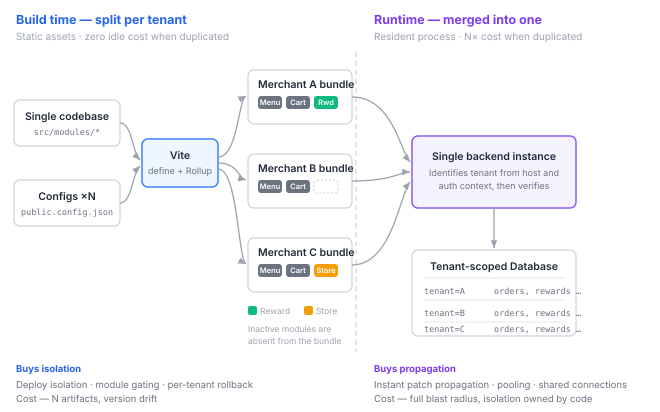

---
# Recommended paths:
# - src/content/notes/ko/<field>/<slug>.md
# - src/content/notes/en/<field>/<slug>.md
title: "Split the Frontend Per Tenant, Merge the Backend Into One"
lang: "en"
translationKey: "tenant-split-frontend-backend"
date: "2026-08-08"
# field: "web" | "game" | "programming-language" | "ai" | "blog"
field: "web"
category: "Architecture"
series: "Moment Coffee"
order: 1
# status: "draft" | "reading" | "implemented" | "stable"
status: "draft"
summary: "One multi-tenant service, yet the frontend is built separately per merchant while the backend runs as a single instance. The reason is that the two layers deal with resources of a different nature."
problem: "Where should the tenant boundary sit in a multi-tenant service, and why do the frontend and the backend arrive at different answers?"
coreIdea: "Static assets cost nothing when idle even if duplicated, while server processes incur residency cost per copy. So the frontend splits at build time to buy isolation, and the backend merges at runtime to buy resource pooling and patch propagation."
connection: "build-time constants, blast radius, resource pooling, tenant isolation, bundler choice"
tags: ["architecture", "multi-tenancy", "vite", "moment-coffee"]
---

# Split the Frontend Per Tenant, Merge the Backend Into One

## 1. About this series

Moment Coffee is a cafe ordering service. Users browse and order menu items before or during a store visit, accumulate rewards based on their order history, and find nearby stores. And this app is **used by multiple merchants, each under their own brand.**

This series records the decisions made while designing its frontend. It isn't a feature tour — it's about **why each choice was made and what was given up in exchange.** Every choice has a discarded side, and looking only at the outcome hides it.

The first post covers the one decision every other decision depends on: **where to split the tenant.**

> [!note] Status of this post
> This is at the design-document stage and has not been implemented. There are no benchmarks or production measurements — only judgments deduced from requirements, and the expected cost of those judgments.

---

## 2. What the requirements force

Four clauses in the specification actually constrain this decision. The rest can be built under any structure, so they don't inform the judgment.

| Clause | Content |
|---|---|
| C1 | The frontend app is **built and deployed separately** per merchant with injected configuration |
| C2 | Screens and tabs of inactive modules are **excluded from the build** |
| C3 | App name, logo, colors, and fonts must be replaceable **without code changes** |
| C4 | **No per-merchant code branching** |

C2 and C4 together are the tricky part. It has to be "a different app per merchant," yet "no per-merchant code branching," and on top of that "inactive modules must not remain in the bundle." The three conditions push against each other.

One business condition sits underneath: the target is **small business owners.** Traffic per merchant is low, and fixed cost per merchant directly determines the break-even point of the business model.

---

## 3. The decision — an asymmetric structure

Starting with the conclusion:

| Layer | Tenant split point | Output |
|---|---|---|
| **Frontend** | **Build time** | N static bundles, one per merchant, each with different modules and branding |
| **Backend** | **Runtime (data layer)** | **A single instance.** Identifies the tenant per request and isolates data |

The shape shows up in the diagram: **it fans out on the left and converges on the right.** A single codebase splits into N at build time, and each split bundle carries a different set of modules. Those N then converge back into one backend at runtime, with isolation pushed down to the data layer.

Same service, different answers per layer. This looked inconsistent at first, but it made sense once I saw that the two layers deal with **resources of a different nature.**

---

## 4. Why asymmetric — duplication costs differ

### 4.1 Static assets cost nothing when idle, even duplicated

A frontend build output is a pile of HTML, JS, and CSS files. Put it in object storage and **it consumes nothing while nobody uses it.** It occupies storage, and that's a few megabytes per bundle.

Ten merchants means ten bundles. But what grew tenfold is **only disk usage** — no additional CPU, memory, or connections. When a request arrives, the CDN simply serves the file.

In other words, duplication on the frontend is nearly free. When that's true, it pays to take whatever duplication can buy you.

### 4.2 Server processes incur residency cost per copy

The backend is the opposite. Spin up an instance and it occupies memory, holds a DB connection pool, answers health checks, and keeps a runtime resident — **even with zero requests.**

Running one instance per merchant multiplies that residency cost by N. But in a service aimed at small business owners, traffic per merchant is low. The result is **a structure where most instances sit idle consuming resources.**

Merging produces the opposite effect.

- **Resource pooling.** Peak hours differ per store. An office-district store peaks in the morning, a campus-area store in the afternoon. When one instance absorbs these waves together, the capacity you must provision for peak is smaller than the sum of individual peaks
- **Shared connection pool.** DB connections are an expensive resource, and holding a separate pool per instance wastes a lot of them

### 4.3 Summary

> **Split the layer where duplication is cheap; merge the layer where duplication is expensive.**

What splitting the frontend buys — module gating, brand separation, deployment isolation — costs only disk. What splitting the backend would buy — failure isolation — costs N times the residency. Hence a different split point per layer.

---

## 5. The means — Vite was adopted as the bundler

What does "splitting" the frontend actually amount to? Injecting tenant configuration into the source at build time and **removing the modules that merchant doesn't use from the bundle entirely.** That is precisely what C2 demands.

A constraint follows from this. **The requirement cannot be met with a runtime conditional.** Judge it during execution, as in `if (config.enabledModules.includes("reward"))`, and the reward screen's code has to be in the bundle regardless. It simply isn't displayed — the user still downloads it. To honor the phrase "excluded from the build," **the value has to be fixed at build time.**

That is what turns the bundler choice from a matter of taste into an architectural decision. This project **adopted Vite as its bundler.**

For the same reason, no metaframework was used. There are two ways to add server rendering, and **both are blocked.**

| Deployment shape | Outcome |
|---|---|
| Single multi-tenant deployment (branch by host) | Only one runtime, so no cost problem. But every merchant's every module ends up in one bundle → **violates C2** |
| Per-merchant deployment | Satisfies C2, but the moment you use SSR you need a server runtime per merchant → the residency cost from 4.2 |

The common argument — "N merchants means N servers" — is refuted by the first shape. So the **primary basis for rejection is C2, not cost.** This isn't a trade-off; it's a requirement not being met.

> [!note] Deferred to the next post
> **By what mechanism** a bundler eliminates unused code, how Vite and Webpack differ at that point, and why Vite therefore fits this requirement better — that is a lot of ground, so it gets its own post.

---

## 6. Stability — isolation and propagation are traded against each other

On the resource axis the decision looks settled, but on the stability axis the two layers have **opposite properties.** This was the most interesting part of the design.

### 6.1 Frontend: buys isolation, sells propagation

Per-merchant builds have a small blast radius. With independent builds in a CI matrix, **a configuration error in tenant A doesn't block tenant B's deployment.** Rollback also happens per tenant.

What it gives up is **artifact version drift.**

With N merchants, N versions coexist in production. A may be current while B sits on a build from months ago. Ship a security patch in that state and you must rebuild and redeploy all N — and **if even one is missed, it stays quietly vulnerable.**

It's dangerous precisely because the failure is invisible. Nobody sees an error.

### 6.2 Backend: buys propagation, sells isolation

A single instance is exactly the reverse. Deploy a patch and **it applies to every tenant at once.** Version drift cannot structurally occur.

In exchange, the blast radius is everything. An instance failure is an outage for every merchant. Two more things come with it.

- **Tenant data isolation becomes the code's responsibility.** Miss the tenant condition in one query and another merchant's data is exposed. Nothing is physically separated, so a mistake is an incident
- **Noisy neighbor.** A traffic spike from one merchant affects response times for others

### 6.3 So each layer defends differently

| Layer | Risk | Defense |
|---|---|---|
| Frontend | A missed patch stays silent | **Deployment inventory** — track which commit each tenant was built from and have CI report tenants that fall behind |
| Frontend | Shared code changes hit all N at once | **Canary tenant** — deploy to one first, then the rest once it passes |
| Backend | Cross-tenant data exposure | Never treat the `tenantId` sent by the frontend as an **authorization basis.** The server must cross-check the tenant from the request host and auth context against the resource's tenant |
| Backend | Total outage | Enforce tenant scope at the data layer and deploy progressively |

The third one matters most. Once you decide to merge the backend, **isolation becomes the responsibility of code rather than infrastructure.** Let the client assert its own tenant and isolation collapses at that moment.

### 6.4 An extension path left open — hardware isolation

"Blast radius is everything" from 6.2 is the largest unresolved item in this design. One common misconception is worth naming here.

**Replicating the same build output across several servers — horizontal scaling — is not isolation.** Scale to ten replicas and capacity is ten times larger, but a code defect sits identically in all ten, and every replica serves every tenant. The blast radius is unchanged. What horizontal scaling buys is **availability and throughput**, not isolation.

To actually buy isolation you have to divide into **cells.** Deploy the same image to several cells, but let each cell serve **only the tenants assigned to it.** A failure is then trapped inside its cell and the blast radius shrinks from everything to one-over-the-number-of-cells. Peeling large tenants onto dedicated cells is a variation of the same idea.

It isn't free, though.

- **Statelessness is a prerequisite.** The moment sessions or caches live in instance memory, replication becomes impossible at all. State has to be pushed out to the database or a shared cache
- **Each cell needs its own minimum capacity.** The pooling benefit gained by merging in 4.2 gets divided again by the number of cells. Buying isolation means selling pooling back
- **Tenant-to-cell assignment and migration** becomes a new operational problem

We are not adopting this at the current scale. It stays a card to play once the traffic condition in section 8 is met.

---

## 7. Trade-offs

| | Gains | Losses |
|---|---|---|
| **Frontend per-tenant build** | C2 satisfied literally (inactive modules removed from the bundle) · minimal initial load per merchant · deployment isolation · per-tenant rollback · C4 structurally enforced | Any config change requires a rebuild and redeploy · build time scales with N · N artifacts to manage · **version drift** |
| **Backend single instance** | Residency cost doesn't scale with N · resource pooling · shared connection pool · **patches propagate immediately** · no version drift | Blast radius is everything · isolation owned by code · noisy neighbor |

Compressed into one line:

> The frontend **bought isolation and sold propagation**; the backend **bought propagation and sold isolation.** Each layer traded on whichever resource was actually expensive there.

---

## 8. Conditions under which this design breaks

Being right now doesn't mean staying right. Here are the indicators to watch, written down in advance.

- **More than 20–30 merchants, or a full build exceeding 15 minutes.** The premise from 4.1 — that duplication is nearly free — starts to wobble. Disk is still cheap, but **build time and deployment surface** become the cost. At that point, move branding to runtime or adopt an incremental pipeline that builds only what changed
- **Traffic per merchant grows.** If the "mostly idle" premise from 4.2 breaks, the pooling benefit shrinks and noisy neighbor becomes a real problem. A hybrid that peels large tenants onto dedicated instances is the candidate
- **Per-tenant regulatory or data isolation requirements.** If physical separation is mandated, the code-based isolation from 6.2 is not enough

---

## 9. Next post

Once this decision is fixed, everything else depends on it. Routing has to build its route array from build constants, style tokens have to split into per-tenant CSS variables, and state management gets redesigned on the premise that the server is the source of truth.

The next post first pays back what section 5 deferred: **what a bundler is and how it works**, where Vite and Webpack diverge within that mechanism, and why Vite fits this project's requirements better.

The post after that moves to the state layer — what it means to treat server data as a cache rather than a value, and how that perspective determined the library choice.
