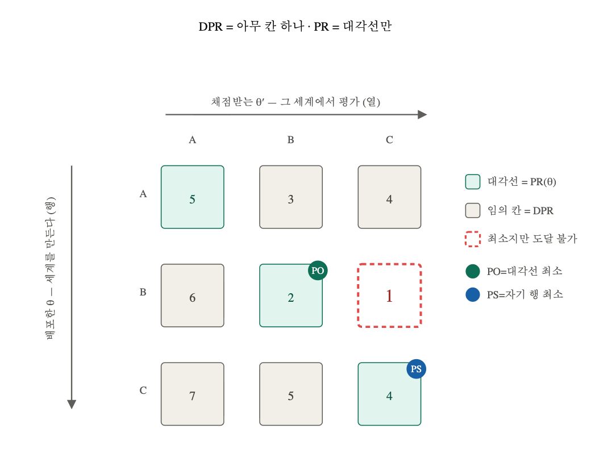

---
# Recommended paths:
# - src/content/notes/ko/<field>/<slug>.md
# - src/content/notes/<field>/<slug>.md
# Folder names are authoring-only. The public URL uses the file name.
title: "Performative Prediction: 변화를 예측하다."
lang: "ko"
translationKey: "Performative-Prediction"
date: "2026-07-21"
# field: "web" | "game" | "programming-language" | "ai"
field: "ai"
category: "Performative Prediction"
series: "Performative Prediction"
# status: "draft" | "reading" | "implemented" | "stable"
status: "implemented"
summary: "머신러닝은 데이터 분포가 고정되어 있다고 가정하지만, 모델의 예측이 결정을 낳고 그 결정이 다시 데이터를 바꾼다면 이 전제는 무너진다. 1954년 GMS 정리가 던진 '공표된 예측이 스스로 실현될 수 있는가'라는 질문에서 출발해, 이를 분포와 손실함수의 언어로 옮긴 Performative Prediction의 프레임워크와 재학습(RRM)이 수렴하기 위한 조건을 정리한다."
problem: "모델의 예측이 데이터 분포를 바꿀 때, 재학습은 한 점으로 수렴하는가 — 그리고 그 조건은 무엇인가."
coreIdea: "재학습은 분포 이동에 대한 땜질이 아니라 평형을 찾아가는 동역학이다. 분포가 도망가는 속도(εβ)가 최적화가 당기는 속도(γ)보다 작으면, 재학습은 축약 사상이 되어 유일한 안정점으로 선형 수렴한다."
connection: "DDA에서 사용자의 실력을 향상시키는 방향으로 Opponent model을 설계할 수 있는가? — 난이도 조절이 곧 플레이어의 실력 분포를 바꾸는 전형적 performative 상황이다."
tags: ["optimization", "performative prediction", "fixed-point", "convergence", "distribution-shift"]
---

# 우리의 결정은 환경을 변화시킨다.

## 0. GMS theorem: 우리의 예측이 정확할 수 있는가

기존의 Machine Learning의 기법은 **Data($Z$)의 분포($D$)가 fixed**($Z\sim D$)된 환경에서의 동작을 위해 설계되었다.

그러나 1954년, Grunberg와 Modigliani 그리고 Simon는 prediction 자체가 환경을 바꿀 수 있는 power를 가질 경우를 생각하게 된다. 이를 **public prediction**이라고 하며 우리의 예측($\hat{y}$)이 공개된 뒤 사회의 실제 반응($R(\hat{y})$)이 우리의 예측과 동일할 수 있는지에 대한 질문이다.

$$
\hat{y} = R(\hat{y})
$$

위에 대한 존재성은 $R$의 연속성과 Brouwer 고정점 정리를 통해 존재 가능하다는 것이 증명되었다.

다만 GMS는 해의 존재성만을 증명하며 스칼라값에서만 동작한다. 이를 분포로 확장하고 해를 구하는 방식으로 확장한 ML 기법이 Performative Prediction(PP)이다.

## 1. Performative Prediction: 어떻게 정확한 예측값을 찾을 수 있는가

### GMS Theorem formulate

앞서 간단하게 살펴본 GMS theorem의 문제를 정의해본다.

- 결과 공간인 $S \in [0,1]$ 이며 compact, convex 하다.
- 응답함수인 $R: S \rightarrow S$ 이며 연속이다.

이때, $\exists\hat{y}^* \in S\::\:\hat{y}^*=R(\hat{y}^*)$ 이 성립하는가?

위 문제를 ML에 직접 적용하기에는 아래와 같은 제약이 존재한다.

1. 예측이 스칼라 집계량이다.
   - GMS에서의 $\hat{y}$은 스칼라 하나다. 하지만 ML에서는 **함수인 $f_\theta$**를 예측해야 한다. 그리고 함수의 input은 여러 특성이 모인 벡터 이상의 $x$가 된다.
2. 결과가 값이지 분포가 아니다.
   - 1번과 유사하게 GMS에서 $R(\hat{y})$의 결과값인 $y$는 하나의 스칼라일 뿐이다. ML에서 요구하는 $(x,y)$ 쌍의 결합 분포가 아니다. 이를 해결하기 위해서는 분포에서 사용할 거리 개념을 다시 세워야 한다.
3. 해의 존재성만을 보여준다.
   - GMS는 해의 존재성만을 증명하기에 **"좋은 예측"이라는 개념이 부재**하다. 특히, $\hat{y}=R(\hat{y})$는 완벽한 예측을 요구하기에 ML에서의 실현은 불가능하다.
4. $R$을 안다고 가정한다.
   - GMS는 응답함수 $R$을 수학적으로 주어진 함수로 취급한다. ML에서는 $\mathcal{D}(\theta)$는 알 수 없다. 배포한 뒤 유한적인 데이터만을 관측할 수 있다.

## 2. Extends GMS to PP

위 제약들을 해결하여 GMS를 ML로 확장한 것이 PP이다. 각 제약을 어떻게 풀어냈는지 살펴보자.

### 2.0 **Distribution Map - "key conceptual device"**

모델 파라미터($\theta \in \Theta \subseteq \mathbb{R}^d$)를 선택하고 모델($f_\theta$)를 배포하면, 그 배포의 결과로 데이터 분포 $\mathcal{D}(\theta)$가 형성된다.

이때, 파라미터의 집합($\Theta$)는 닫힌 볼록집합이다.

$$
R:[0,1]\rightarrow[0,1]\Rightarrow \mathcal{D}:\Theta\rightarrow
\Delta(\mathcal{X}\times\mathcal{Y})
$$

이때, $\mathcal{X}\subseteq{\R^d}$인 input이고 $\mathcal{Y}\subseteq\R$인 output이다. 이제 이 분포의 오차값을 측정하기 위해 Wasserstein-1 distance를 도입한다.

$$
\mathcal{W}(\mathcal{D}(\theta),\mathcal{D}(\theta '))\leq\epsilon\Vert\theta-\theta '\Vert_2
$$

이렇게 등장한 분포 $\mathcal{D(\theta)}\in\Delta(\mathcal{X}\times\mathcal{Y})$에서 모델의 성능을 측정하기 위해 새로운 목적함수 $\text{Risk}$를 도입한다.

$$
\text{Risk}(\theta, \mathcal{D(\theta)}) = \mathbb{E}_{z\sim \mathcal{D}(\theta)}[\ell(z;\theta )]
$$

이제, PP에서 묻는 질문은 두 가지가 된다.

1. 이 모델이 자기가 만든 분포에서 고정점인가(stability)
2. 가능한 모든 모델-환경 쌍 중 최선인가(optimality).

우리는 위 두 질문에 대해 각각의 평가 기준을 세워서 평가하고자 한다.

### 2.1 Performative Stability: GMS fixed Point

$$
\theta_{\text{PS}}\in\argmin_\theta \mathbb{E}_{Z\sim \mathcal{D}(\theta_{\text{PS}})}\ell(Z;\theta)
$$

$\theta_{\text{PS}}$는 우변에서 데이터($Z$)의 분포$(D(\theta_{\text{PS}}))$를 구성한다. 이와 동시에 우변에서는 $Z\sim \mathcal{D}(\theta_{\text{PS}})$ 환경에서 모델을 통한 예측 후에 모델을 구성하는 파라미터의 output이 된다.

즉, $\theta_{PS}$ 가 만든 분포에서 다시 위험을 최소화해도 같은 모델이 나온다. 고정점이 사는 곳은 분포 공간이 아니라 파라미터 공간($\Theta$)이며, 이 점에서 GMS 고정점의 역할을 이어받는다.

PS를 다루려면 1) '환경을 만든 모델'과 2) '채점받는 모델'을 **따로 놓을 수 있어야 한다.** 그래야 '둘이 같다'를 조건으로 쓸 수 있기 때문이다. 이 분리 장치가 **Decoupled Performative Risk(DPR)**이다.

$$
\text{DPR}(\theta,\theta ')\stackrel{\text{def}}{=}\mathbb{E}_{Z\sim \mathcal{D}(\theta)}\ell(Z;\theta')
$$

위 식에서는 **$\theta$ 모델을 통해 생성된 세계**에서 **$\theta'$로 구성된 모델**이 채점된다.

이를 $\text{PS}$에서 해석하면 $\theta_\text{PS}=\argmin_\theta\text{DPR}(\theta_{\text{PS}},\theta)$가 된다.

즉, $\theta_{\text{PS}}$가 만든 환경에서 $\theta$를 통해 생성된 모델을 평가하는데, 평가되는 환경과 모델이 생성되는 환경이 동일하다면 이는 **Performative stable**하다고 할 수 있다.

### 2.2 Performative Optimality: Stackelberg equilibria

$$
\begin{aligned}
\text{PR}(\theta)\stackrel{\text{def}}{=}\mathbb{E}_{Z\sim\mathcal{D}(\theta)}\ell(Z;\theta)\\
\theta_{PO}=\argmin_\theta\text{PR}(\theta)
\end{aligned}
$$

stability와 별개로, '가능한 것 중 최선'을 묻는 두 번째 해 개념이 있다. 이쪽은 고정점 조건이 아니라 전역 최소화 문제이고, 게임이론의 Stackelberg 균형에 대응한다.

**Performative Risk**는 $\theta$에 의해 정의되는 모델을 배포한 뒤, 그로 인해 탄생하는 데이터 분포($\mathcal{D}(\theta)$)에서 모델의 성능을 측정한 값이다. 이때, 모델의 형태 또한 환경과 마찬가지로 $\theta$에 관련된 함수이다.

PR은 **모델이 탄생시킨 데이터 환경에서** 모델의 성능을 측정한다는 점에서 앞서 살펴본 *DPR*과는 차이가 있다.

앞서 우리는 $\theta$가 모델-환경 쌍을 구성한다는 것을 확인했다. $\theta$가 만드는 (모델, 그 모델이 유발한 환경) 쌍들 중에서, 그 쌍의 손실이 가장 낮은 것을 우리는 **Performative Optimality**라고 한다.

> [!warning] 두 해 개념은 일반적으로 **일치하지 않는다.** $\theta_{\text{PO}}$는 최선이지만 배포 후 재학습하면 다른 곳으로 옮겨가고(불안정), $\theta_{\text{PS}}$는 안정하지만 최선이 아니다. 이 간극을 재는 것은 다음 글의 주제이며, 이번 글은 **도달 가능한 쪽**인 $\theta_{\text{PS}}$에 집중한다.

### PR와 DPR의 시각적 비교



## 3. How to find stable points?

이제 우리는 Performative Prediction 문제를 정의할 수 있게 되었다. 그렇다면 해는 어떻게 구할까? 이를 알기 위해서는 우선적으로 **수렴 가능성(convergence)** 에 대한 판단이 우선되어야 한다.

### 3.0 Repeated risk minimization

Performative Prediction의 동작 과정을 복기해보자. 우리의 최적화 대상은 $\theta$이다.

1. Optimization response: 고정된 분포 $\mathcal{D}(\theta_t)$에서 risk를 최소화하여 $\theta_{t+1}$을 얻는다.
2. Performative response: 새 모델 $\theta_{t+1}$을 배포하면 다음 데이터 분포가 $\mathcal{D}(\theta_{t+1})$로 바뀐다.

이때, "모델 배포 → 새 데이터 수집 → 그 데이터로 다시 학습 → 재배포"라는 일련의 과정을 **Repeated risk minimization(RRM)** 이라고 하며 이를 식으로 표현하면

$$
\theta_{t+1}=G(\theta_t)\stackrel{\text{def}}{=}\argmin_{\phi\in\Theta}\mathbb{E}_{Z\sim\mathcal{D}(\theta_t)}\ell(Z;\phi)
$$

가 된다.

수렴을 위해서는 고정된 분포에서의 risk minimization이 제공하는 안정화 효과가, 모델 배포로 발생하는 distribution shift의 교란보다 강해야 한다.

### 3.1 $\varepsilon$-sensitivity

분포의 변화량을 확인하기 위해 Wasserstein-1 distance($W_1$)을 도입한다. 이를 $L_2$를 적용한 $\theta$ 변화량과 비교하여 분포 변화의 민감도를 구한 것이 $\varepsilon$-sensitivity이다.

$$
W_1(\mathcal{D}(\theta),\mathcal{D}(\theta'))\leq\varepsilon\Vert\theta-\theta'\Vert_2
$$

> [!info] Wasserstein distance는 확률 분포 간의 거리를 측정하는 방법이다.

### 3.2 $\gamma$-strongly convex

> [!tip] 볼록성과 관련된 내용은 최적화와 밀접한 관련이 있기에 따로 정리해보고자 한다.

RRM은 **고정점 반복(fixed-point iteration)** 이며 **수축(contraction)** 을 보장하는 정량적 수치가 강볼록성이다.

$$
\ell(z;\theta)
\ge
\ell(z;\theta')
+
\nabla_{\theta}\ell(z;\theta')^{\top}(\theta-\theta')
+
\frac{\gamma}{2}\|\theta-\theta'\|_2^2,
\qquad
\forall \theta,\theta'\in\Theta,\; z\in\mathcal Z.
$$

### 3.3 $\beta$-jointly smooth

$$
[
\left\|
\nabla_{\theta}\ell(z;\theta)
-
\nabla_{\theta}\ell(z;\theta')
\right\|_2
\le
\beta
\left\|
\theta-\theta'
\right\|_2,
\qquad
\forall \theta,\theta'\in\Theta,\; z\in\mathcal Z,
]

[
\left\|
\nabla_{\theta}\ell(z;\theta)
-
\nabla_{\theta}\ell(z';\theta)
\right\|_2
\le
\beta
\left\|
z-z'
\right\|_2,
\qquad
\forall \theta\in\Theta,\; z,z'\in\mathcal Z.
]
$$

$\theta$와 $z$에 대한 $\nabla_\theta\ell(z;\theta)$의 $\beta$-Lipschitz를 따지는 것이다. 이는 파라미터에 의한 학습 gradient의 민감도를 따진다. 만약, 학습 gradient의 민감도가 너무 크다면(eg. $\beta=\infty$) gradient가 제멋대로 튀며 학습이 되지 않는다.

> [!tip] Lipschitz는 **축약사상(contraction map)** 에 대한 개념과 연관이 있으므로 축약 사상과 함께 따로 다뤄보겠다.

### 3.4 Convergence of RRM

이제 수렴 증명을 위한 토대를 모두 준비되었다. loss function을 $\beta$-jointly smooth 하며 $\gamma$-strongly convex하다고 가정하자.

$$
\begin{align}
\;\Vert G(\theta)-G(\theta')\Vert_2\leq\varepsilon\frac{\beta}{\gamma}\Vert\theta-\theta'\Vert_2,\;for\;all \;\theta,\theta'\in\Theta
\end{align}
$$

위 식에서 앞으로 $\varepsilon\frac{\beta}{\gamma}$를 $q$로 대체하겠다. 이 경우, 식 (1)은 두 모델 $\theta, \theta'$에 대해서 배포한 뒤 결과 모델 $G(\theta),G(\theta')$ 사이의 거리가 멀어지는 정도를 제한한다.

```text
현재 모델 차이
‖θ - θ′‖
     ↓ retraining operator G
다음 모델 차이
‖G(θ) - G(θ′)‖
     ≤ (εβ/γ) ‖θ - θ′‖
```

위에서 봤던 변수들($\varepsilon,\beta,\gamma$)의 역할을 정리하면 아래와 같다.

| 상수         | 의미                                                 | ($q=\epsilon\beta/\gamma$)에 미치는 영향 |
| ------------ | ---------------------------------------------------- | ---------------------------------------- |
| ($\epsilon$) | 모델 변화가 distribution을 얼마나 변화시키는가       | 클수록 불안정                            |
| ($\beta$)    | 데이터 또는 모델 변화가 gradient에 얼마나 전달되는가 | 클수록 불안정                            |
| ($\gamma$)   | objective가 minimizer로 되돌리는 곡률                | 클수록 안정                              |

$$
\begin{align}
\epsilon < \frac{\gamma}{\beta}
\quad\Longrightarrow\quad
\left\|\theta_t-\theta_{\mathrm{PS}}\right\|_2
\leq \delta
\quad
\text{for }
t
\geq
\left(
1-\frac{\epsilon\beta}{\gamma}
\right)^{-1}
\log
\left(
\frac{
\left\|\theta_0-\theta_{\mathrm{PS}}\right\|_2
}{
\delta
}
\right)
\end{align}
$$

(2)의 식에서는 $q\lt 1$의 조건이 추가된다. 해당 조건은 $G$가 **contraction mapping**이 되도록 하기에 *Banach fixed-point theorem*에 의해 아래 성질들을 얻는다.

1. $G$에는 유일한 fixed point $\theta_{PS}$가 존재한다.
2. 임의의 초기값 $\theta_0$에서 RRM이 그 fixed point로 수렴한다.
3. 오차는 매 반복마다 최대 $q$배로 감소한다.

이떄, fixed point의 조건은 $G(\theta_{PS})=\theta_{PS}$이며 이는 performative stability이다.

(1)의 조건을 (2)에 적용하게 되면 오차는 매 반복 $q$배씩 줄어드는 등비수열이 되며 $q^t$는 $t$회 반복 후의 누적 감쇠율이다. 또한 오차의 목표값을 $\delta$로 설정하면 식 (2)에서와 같은 필요한 수렴 횟수 $t$가 등장한다.

>[!tip] 세 가정 중 어느 하나만 제거해도 RRM이 발산하는 반례가 존재한다(Prop 3.6). 특히 볼록이지만 강볼록이 아닌 선형 손실에서는 sensitivity가  아무리 작아도 1, −1, 1, −1, 1, −1, 1, −1로 진동한다. 지도학습에서 속도만 좌우하던 강볼록성이, 성능성 환경에서는 수렴의 필요조건으로 격상된다.

### 3.5 Repeated gradient descent

RRM은 매 반복마다 정확한 최소화 오라클(exact optimization oracle)을 필요로 한다. 실제로는 한 번의 학습조차 근사적으로 끝내는 것이 보통이므로, 이를 **경사하강 한 스텝**으로 대체한 것이 **Repeated Gradient Descent(RGD)** 이다.

$$
\theta_{t+1}
=
G_{\text{gd}}(\theta_t)
\stackrel{\text{def}}{=}
\Pi_{\Theta}
\left(
\theta_t
-
\eta\,
\mathbb{E}_{Z\sim\mathcal{D}(\theta_t)}
\nabla_{\theta}\ell(Z;\theta_t)
\right)
$$

여기서 $\eta>0$은 스텝사이즈, $\Pi_{\Theta}$는 $\Theta$로의 유클리드 사영이다. $\Theta$가 볼록집합이어야 사영이 잘 정의되므로, *2.0*장에서 둔 가정이 필요하다.

중요한 점은 이 gradient descent는 **손실 $\ell$의 기울기만 요구한다**는 것이다. $\text{PR}(\theta)$의 기울기, 즉 분포 맵 $\mathcal{D}(\cdot)$를 미분한 항은 필요하지 않다. 

세상이 어떻게 반응하는지($\mathcal{D}$의 형태)를 모르더라도, **관측된 데이터에 대해 기존의 ML처럼 경사하강을 돌리기만 하면** 된다. 성능성을 다루면서도 알고리즘 자체는 기존 학습 코드와 다르지 않다는 뜻이다.

RGD 역시 축약 사상이며, 조건이 만족되면 같은 $\theta_{\text{PS}}$로 선형 수렴한다. 수축 계수는

$$
q_{\text{gd}}
=
1
-
\eta
\left(
\frac{\beta\gamma}{\beta+\gamma}
-
\varepsilon\left(1.5\,\eta\beta^{2}+\beta\right)
\right),
\qquad
\eta \le \frac{2}{\beta+\gamma}
$$

이고, 수렴 조건은 다음과 같다.

$$
\varepsilon

\frac{\gamma}{(\beta+\gamma)\left(1+1.5\,\eta\beta\right)}
$$

$(\beta+\gamma)(1+1.5\eta\beta)>\beta$ 이므로 이 수렴 조건은 RRM의 $\gamma/\beta$ 보다 **까다롭다**. 한 스텝에 완전 최소화 대신 기울기 한 번만 쓰므로 **당기는 힘이 약해지고, 그만큼 견딜 수 있는 성능성도 줄어든다**는 의미를 가진다.

RRM과 RGD를 한 눈에 비교하면 아래와 같다.

| 항목            | RRM                        | RGD                                                     |
| --------------- | -------------------------- | ------------------------------------------------------- |
| 한 스텝         | $\arg\min$ 완전 계산       | 기울기 한 번                                            |
| 필요한 것       | 최적화 오라클              | $\nabla_\theta\ell$, 스텝사이즈 $\eta$                  |
| $\mathcal{D}$ 미분 | 불필요                  | 불필요                                                  |
| $\varepsilon$ 문턱 | $\dfrac{\gamma}{\beta}$ | $\dfrac{\gamma}{(\beta+\gamma)(1+1.5\eta\beta)}$ (더 작음) |
| 수렴            | 선형                       | 선형 (더 느림)                                          |
| $\varepsilon=0$ | 1스텝에 수렴               | 고전 GD 수렴률                                          |

## 4. 정리 — 무엇을 답했고 무엇이 남았는가

이번 글이 답한 질문은 하나다. **"모델이 데이터 분포를 바꾸는 환경에서, 재학습은 한 점으로 수렴하는가?"**

답은 조건부 성립이었다. 손실이 $\gamma$-strong convex, $\beta$-smoothness이고 분포 맵이 $\varepsilon$-sensitive일 때, 재학습 연산자 $G$는 축약 사상이 되고

$$
\varepsilon < \frac{\gamma}{\beta}
\qquad\Longleftrightarrow\qquad
\underbrace{\varepsilon\beta}_{\text{분포가 도망가는 속도}}
\;
\underbrace{\gamma}_{\text{최적화가 당기는 속도}}
$$

이면 유일한 안정점 $\theta_{\text{PS}}$로 선형 수렴한다. 세 가정 중 어느 하나만 빼도 발산하는 반례가 존재하므로 이 결과는 더 약화할 수 없다.

그러나 여기까지는 **"재학습이 어디로 가는가"** 에 대한 답일 뿐이다. 두 가지가 남아 있다.

### 남은 문제 1: 모집단 가정

위 논의는 모두 "모집단 수준(population level)"에서 이루어졌다. 즉 $\mathcal{D}(\theta_t)$에 대한 기댓값을 정확히 계산할 수 있다고 가정했다. 그러나 1장에서 지적했듯 현실에서 우리가 관측하는 것은 배포 이후의 **유한한 표본**뿐이다. 원 논문은 이 경우에도 고확률로 안정점 근방에 도달하고 그 안에 머문다는 것을 보인다(RERM/REGD).

### 남은 문제 2: $\theta_{\text{PS}}$는 $\theta_{\text{PO}}$가 아니다

더 근본적인 문제가 남았다. 2장에서 우리는 해 개념을 **2가지**로 정의했다.

| | 정의 | 성격 |
| --- | --- | --- |
| $\theta_{\text{PS}}$ | 자기가 만든 분포에서 재학습해도 그대로 | 고정점 — **도달 가능** |
| $\theta_{\text{PO}}$ | 모든 모델-환경 쌍 중 손실 최소 | 전역 최적 — **우리가 원하던 것** |

그리고 앞서 3장 전체는 **$\theta_{\text{PS}}$** 만 다뤘다. 우리가 도달한 곳은 "원하던 최선"이 아니라 "재학습이 데려다준 곳"이다.

$\theta_{\text{PS}}$는 본인으로부터 유발한 데이터로는 반박되지 않는다. 지금 조건에서 데이터를 모아 위험 최소화를 다시 풀어도 같은 모델이 나오므로, **그 안에서는 더이상의 개선의 여지가 보이지 않는다**. 그러나 이는 더 나은 모델이 없다는 뜻과 동치가 아니다.

그렇다면 아래왁 같은 질문이 남는다.

> **도달한 안정점은 원하던 최적점과 얼마나 다른가?**

안정점이 최적점과의 차이가 크지 않아야 앞서 우리가 살펴본 방식이 정당화된다.

다음 글에서는 이 질문에 답하고자 한다. 다음 세 갈래로 진행된다 
1. **약한 가정에서도 안정점이 존재하는가**
2. **최적점을 직접 겨냥하는 것은 왜 어려운가**
3. **두 해 사이의 거리에 상한을 줄 수 있는가**. 

이 답이 있어야 비로소 프레임워크가 완성된다.

## 참고문헌
- Hardt, Moritz, and Celestine Mendler-Dünner. "Performative prediction: Past and future." Statistical Science 40.3 (2025): 417-436.
- Perdomo, Juan, et al. "Performative prediction." International Conference on Machine Learning. PMLR, 2020.

## 연결

- 관련 프로젝트: staged DDA matgo
- 관련 실험:
- 다음에 확인할 질문: RRM에서의 해답은 PO를 만족할 수 있는가?
