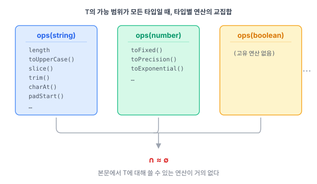
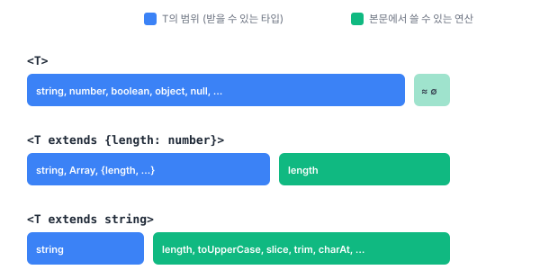

---
# Recommended paths:
# - src/content/notes/ko/<field>/<slug>.md
# - src/content/notes/en/<field>/<slug>.md
title: "제네릭은 조이는 장치가 아니라 잇는 장치다"
lang: "ko"
translationKey: "parametric-polymorphism"
date: "2026-07-27"
# field: "web" | "game" | "programming-language" | "ai"
field: "programming-language"
category: "typescript"
series: "javascript/typescript"
# status: "draft" | "reading" | "implemented" | "stable"
status: "implemented"
summary: "제네릭을 매개변수 다형성으로 이해하고, 제약이 무엇을 사고 무엇을 파는 거래인지 집합의 관점에서 정리합니다."
problem: "제네릭은 무엇을 해결하기 위해 등장했으며, T extends X 같은 제약은 정확히 무엇을 얻고 무엇을 잃는가?"
coreIdea: "제네릭은 호출자의 타입을 반환까지 잇는 장치이고, 제약은 T의 범위를 잘라 본문에서 쓸 수 있는 연산의 교집합을 키우는 거래다."
connection: "types as sets, parametricity, bounded quantification, 변성"
tags: ["typescript", "javascript"]
---

# 매개변수 다형성과 유계 정량화

## 문제

`any`는 정적 타입 검사를 비활성화한다. 이로 인해 발생하는 문제는 **두 종류**이며 이 둘을 구분하는 것이 이 글의 출발점이다.

```ts
// (1) 아무도 모르는 값
const data: any = JSON.parse(input);
data.foo.bar(); // 검사 없이 통과

// (2) 호출하는 쪽은 알고 있던 값
function identity(x: any): any { return x; }
const s = identity("hello"); // s: any
```

(1)은 **검사 실패**다. `data` 값의 형태를 아무도 모르는데 어떠한 연산이나 허용된다.

(2)는 (1)번 문제와는 성격이 다르다. `identity("hello")`를 호출한 쪽은 인자가 `string`임을 분명히 알고 있었다. 그런데 함수 경계를 지나자 그 정보가 사라졌다. 이것은 타입의 **운반 실패**다.

```
호출하는 쪽이 아는 것: "hello" 는 string
        │
        │ 함수 경계 통과
        ▼
반환값에 대해 아는 것: any
```

두 문제는 원인이 다르므로 해법도 달라야 한다. (1)의 해법은 `unknown`이고 (2)의 해법이 **제네릭**이다.

> 호출 시점의 타입 정보를 어떻게 함수 경계 너머로 운반할 것인가?

## 0. Overview

이 글은 다음 순서로 진행한다.

```
Parametric polymorphism  → 제네릭은 무엇인가
Parametricity            → 왜 본문에서 아무것도 못 하는가
Bounded quantification   → 제약은 무엇을 사고 무엇을 파는가
Types as sets            → 그 거래의 메커니즘은 무엇인가
```

## 1. Parametric polymorphism: 타입을 매개변수로 받는다

제네릭의 핵심은 입력과 출력에 **같은 이름표**를 붙이는 것이다. 타입을 일종의 변수로 취급한다고 생각하면 된다.

```ts
function identity<T>(x: T): T {
  return x;
}

const a = identity("hi"); // a: "hi"
const b = identity(10);   // b: 10
```

`T`는 값 대신 **타입을 담는 변수**다. 값을 매개변수로 받듯 타입을 매개변수로 받으므로 이를 **매개변수 다형성(parametric polymorphism)** 이라고 한다.

논리식으로 작성하면 아래와 같다.

$$
\texttt{identity} : \forall T.\ T \rightarrow T
$$

"모든 타입 $T$에 대하여, $T$를 받아 $T$를 반환한다." 함수 앞에 **전칭 정량자($\forall$)가** 붙은 형태다.

`any`와 비교하면 차이가 드러난다.

```ts
function identityAny(x: any): any { return x; }

const c = identity("hi");    // "hi"  — 알던 타입이 살아 나온다
const d = identityAny("hi"); // any   — 경계에서 증발한다
```

제네릭은 검사를 강화하는 장치가 아니라 **정보를 잃지 않고 흘려보내는 장치**다.

## 2. Parametricity: 그 대가로 본문은 무력해진다

`T`가 모든 타입이 될 수 있다는 것은 곧 본문에서 `T`에 대해 **아무것도 가정할 수 없다**는 뜻이다. 임의로 `T`를 `number`나 `string`으로 취급할 수 없다.

```ts
function bad<T>(x: T): T {
  console.log(x.length); // Error: Property 'length' does not exist on type 'T'
  return x;
}
```

`T`가 `string`일 수도 있지만 `number`일 수도 있다. 함수는 **모든 T에 대해** 성립해야 하므로 모든 T가 공통으로 가진 것만 사용할 수 있다. 그리고 모든 타입이 공통으로 가진 것은 사실상 없다.

이 성질을 **parametricity**라고 한다. 불편해 보이지만 강력한 보장이기도 하다. `∀T. T → T`라는 타입을 만족하는 함수는 사실상 항등함수 하나뿐이다. 구현을 보지 않고도 타입만으로 동작을 좁힐 수 있다.



## 3. Bounded quantification: T의 범위를 제한한다

본문에서 아무것도 못 한다면 실용성이 없다. 실제로 우리가 쓰고 싶은 함수는 이런 것이다.

```ts
function longest<T>(x: T, y: T): T {
  return x.length >= y.length ? x : y; // Error
}
```

여기서 선택지는 세 가지다.

```
(1) any 로 후퇴        → 검사 실패로 되돌아간다
(2) string(혹은 length를 가지는 type)으로 고정     → 지정한 타입 외에는 재사용할 수 없다
(3) T가 될 수 있는 범위를 length와 호환되는 타입으로 제한한다.
```

(3)의 방법이 가장 확장성이 좋다.

```ts
function longest<T extends { length: number }>(x: T, y: T): T {
  return x.length >= y.length ? x : y; // OK
}

const s = longest("hello", "hi");    // s: string
const arr = longest([1, 2, 3], [4]); // arr: number[]

s.toUpperCase(); // string 고유 연산도 가능하다
```

`T extends X`를 **유계 정량화(bounded quantification)** 라고 한다.

$$
\texttt{longest} : \forall T \sqsubseteq \{\texttt{length}: \text{number}\}.\ (T, T) \rightarrow T
$$

"이 상한(upper bound) 아래의 모든 T에 대하여"라는 의미다. 이제 본문은 `length`를 가정할 수 있고, 동시에 호출자의 구체 타입은 제네릭을 통해 반환까지 그대로 운반된다.

## 4. 이 거래에서 무엇을 사고 무엇을 파는가

제네릭에 제약을 추가함으로써 우리가 바꾸는 축은 다음 2가지이다.

```ts
function f0<T>(x: T) {
  x.length;                    // Error — 아무것도 가정 못 함
}
f0("hi"); f0(10); f0({}); f0(null);          // 호출자: 전부 통과

function f1<T extends { length: number }>(x: T) {
  x.length;                    // OK
  x.toUpperCase();             // Error — string 전용은 여전히 불가
}
f1("hi"); f1([1, 2]); f1({ length: 3 });     // 호출자: length 있는 것만
f1(10);                                       // Error

function f2<T extends string>(x: T) {
  x.toUpperCase(); x.slice(1); // OK — string 전 API
}
f2("hi");
f2([1, 2]);                                   // Error
```

아래로 갈수록 **본문에서 가능한 것이 늘고, 호출자가 넣을 수 있는 것이 줄어든다**. 안전성은 세 경우 모두 동일하게 유지된다.

| | 본문에서 가능한 것 | 받을 수 있는 타입 |
|---|---|---|
| `<T>` | 거의 없음 | 전부 |
| `<T extends {length:number}>` | `length` | length를 가진 것 |
| `<T extends string>` | string 전 API | string |



## 5. 메커니즘: 타입은 값의 집합이다

두 축이 정확히 반대로 움직이는 이유는 앞선 글의 **types as sets**로 설명된다.

당시 우리는 union 타입에서 이런 결론을 얻었다.

$$
\text{타입은 합집합, 가능한 연산은 교집합}
$$

`string | number`에 대해 `toUpperCase()`를 쓸 수 없었던 이유는 가능한 연산이 두 타입의 **교집합**이었기 때문이다.

제네릭에도 같은 규칙이 적용된다.

$$
\text{본문에서 가능한 연산} = \bigcap_{\tau \in \text{range}(T)} \text{ops}(\tau)
$$

| T의 가능 범위 | 교집합 = 쓸 수 있는 것 |
|---|---|
| 무제약 `<T>` → 모든 타입 | 없음 |
| `T extends string \| number` | `toString()` 만 |
| `T extends {length:number}` | `length` |
| `T extends string` | string 전 API |

실제로 확인해 보면 그대로다.

```ts
function h<T extends string | number>(x: T) {
  x.toString();     // OK — 둘 다 가진다
  x.toUpperCase();  // Error — number에는 없다
}
```

즉 무제약 `<T>`가 무력한 이유는 "모든 타입의 합집합"이나 마찬가지라 교집합이 비어 있기 때문이다.

그리고 이제 두 축이 왜 반대로 움직이는지가 분명해진다. `T extends X`는 **T의 가능 범위를 잘라내는 동작 하나**뿐이다. 그 한 번의 절단이 두 결과를 동시에 만든다.

```
T extends X  (범위를 X 아래로 자른다)
        │
        ├─ 남은 것들이 전부 X의 멤버를 가진다  → 본문이 쓸 수 있다
        │
        └─ 잘려나간 타입은 인자로 들어올 수 없다 → 호출자의 자유가 준다
```

<details>
<summary>필자의 생각</summary>
이 원리는 제네릭에만 있는 것이 아니다. 앞선 글에서 함수 매개변수가 반공변이어야 하는 이유를 "받는 것은 관대하게"로 정리했는데 그것 역시 같은 구조다. 넓게 받을수록 그 값에 대해 가정할 수 있는 것이 줄어든다.

변성은 이 원리가 **할당 가능성 판정**에 적용된 형태이고 제네릭 제약은 같은 원리가 **본문의 표현력**에 적용된 형태다. 서로 다른 장에서 배우지만 뿌리는 하나라고 생각한다.
</details>

## 6. 연습

다음 코드에서 각 위치의 타입이 어떻게 결정될지, 그리고 어느 줄이 에러가 될지 생각해 보자.

```ts
function first<T extends { length: number }>(xs: T): T { return xs; }

const r1 = first("hello");
const r2 = first([1, 2, 3]);
const r3 = first({ length: 0, extra: true });
const r4 = first(42);

function g<T>(x: T) {
  if (typeof x === "string") {
    return x.toUpperCase();
  }
  return x;
}
```

## 7. 결론

```
Parametric polymorphism
→ 제네릭은 타입을 매개변수로 받는다. ∀T. T → T

운반이 목적이다
→ any는 호출자가 알던 타입을 경계에서 잃는다.
→ 제네릭은 입력과 출력을 같은 이름으로 묶어 그것을 보존한다.

Parametricity
→ 그 대가로 T에 대해 아무것도 가정할 수 없다.
→ 제약은 제네릭의 목적이 아니라 대가다.

Bounded quantification
→ T extends X 는 T의 범위를 상한 아래로 자른다.
→ 본문의 능력을 사고, 호출자의 자유를 판다. 안전성은 무관하다.

Types as sets
→ 본문에서 가능한 연산 = T의 가능 범위에 속한 타입들의 교집합.
→ 범위를 자르면 교집합이 커진다. 한 절단의 두 결과다.
```

한 문장으로 정리하면 다음과 같다.

> 제네릭은 타입을 아니라 **이어주는** 장치이며, 제약은 T의 가능 범위를 잘라 본문에서 쓸 수 있는 연산의 교집합을 키우는 거래다.

## 전체 코드

이 글에 등장한 코드를 하나의 파일로 모았다. 에러가 예상되는 줄에는 `@ts-expect-error`를 달아 두었으므로 `tsc --strict`로 전체가 통과하는지 확인할 수 있다.

```ts
// ── § 문제: any의 두 가지 문제 ──────────────────────

const data: any = JSON.parse("{}");
data.foo.bar();

function identity<T>(x: T): T { return x; }
function identityAny(x: any): any { return x; }

const a = identity("hi");    // "hi"
const b = identity(10);      // 10
const c = identityAny("hi"); // any

// ── § Parametricity: 본문은 무력하다 ────────────────

function bad<T>(x: T): T {
  // @ts-expect-error — T에 length가 없다
  console.log(x.length);
  return x;
}

// ── § Bounded quantification ────────────────────────

function longest<T extends { length: number }>(x: T, y: T): T {
  return x.length >= y.length ? x : y;
}

const s = longest("hello", "hi");
const arr = longest([1, 2, 3], [4]);
s.toUpperCase();

// ── § 제약 수준별 비교 ─────────────────────────────

function f0<T>(x: T) {
  // @ts-expect-error
  x.length;
}
f0("hi"); f0(10); f0({}); f0(null);

function f1<T extends { length: number }>(x: T) {
  x.length;
  // @ts-expect-error
  x.toUpperCase();
}
f1("hi"); f1([1, 2]); f1({ length: 3 });
// @ts-expect-error
f1(10);

function f2<T extends string>(x: T) {
  x.toUpperCase(); x.slice(1);
}
f2("hi");
// @ts-expect-error
f2([1, 2]);

// ── § Types as sets ─────────────────────────────────

function h<T extends string | number>(x: T) {
  x.toString();
  // @ts-expect-error
  x.toUpperCase();
}

// ── § 연습 ──────────────────────────────────────────

function first<T extends { length: number }>(xs: T): T { return xs; }

const r1 = first("hello");
const r2 = first([1, 2, 3]);
const r3 = first({ length: 0, extra: true });
// @ts-expect-error
const r4 = first(42);

function g<T>(x: T) {
  if (typeof x === "string") {
    return x.toUpperCase();
  }
  return x;
}
```

## 연결

- 다음에 확인할 질문: `identity("hi")`처럼 타입 인자를 생략했을 때 compiler는 T를 어떻게 결정하는가?
