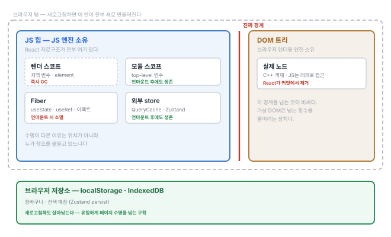
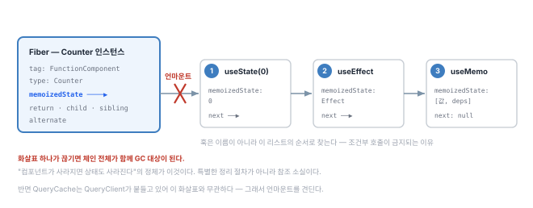
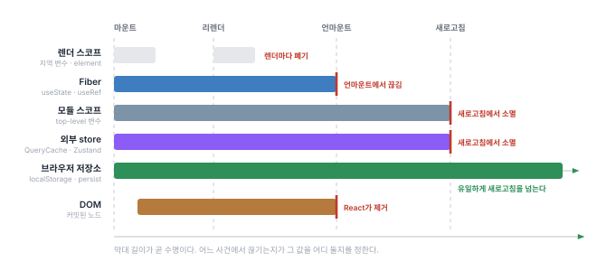

---
# Recommended paths:
# - src/content/notes/ko/<field>/<slug>.md
# - src/content/notes/en/<field>/<slug>.md
title: "React에 전용 메모리는 없다"
lang: "ko"
translationKey: "react-memory-partitions"
date: "2026-08-09"
# field: "web" | "game" | "programming-language" | "ai" | "blog"
field: "web"
category: "react"
series: "모먼트 커피"
order: 4
# status: "draft" | "reading" | "implemented" | "stable"
status: "reading"
summary: "\"데이터는 Context를 타지 않는다\"는 한 문장에서 시작했다. React에 전용 메모리 계층이 있는 줄 알았는데, 있는 건 물리적 분리가 아니라 수명 구획이었다."
problem: "React 앱에서 상태는 정확히 어디에 저장되는가? 탭을 옮겼다 와도 캐시는 살아있는데 새로고침하면 사라지는 이유는 무엇인가?"
coreIdea: "물리적으로는 전부 같은 JS 힙이다. 진짜 경계는 JS 힙과 DOM 사이 하나뿐이고, 나머지는 수명으로 나뉜 논리적 구획이다. 상태를 어디 둘지는 이 구획 중 어디에 두느냐의 문제다."
connection: "Fiber, JS 힙, 수명 구획, 가비지 컬렉션, 상태 소유권"
tags: ["react", "fiber", "메모리", "상태관리", "모먼트커피"]
---

# React에 전용 메모리는 없다

## 1. 문장 하나가 걸렸다

[3편](/notes/server-state-as-cache/)에서 TanStack Query의 캐시가 어디에 사는지 정리하다가 이런 설명을 마주쳤다.

> `QueryClientProvider`가 Context로 내려주는 건 클라이언트 인스턴스뿐이고, **데이터는 Context를 타지 않는다.**

납득은 됐다. Context에 데이터를 직접 넣으면 구독 트리 전체가 리렌더되니 주소만 내려주고 각자 구독하게 만든 구조가 합리적이다.

그런데 문장이 걸렸다. **데이터가 Context를 안 탄다면, 대체 어디로 다니는 걸까.**

Context는 React가 제공하는 통로다. 그 통로를 안 탄다면 React 바깥으로 다니는 셈인데 "React 바깥"이라는 게 정확히 어디인지는 그려지지 않았다.

## 2. 그래서 이렇게 짐작했다

> React에는 내가 모르는 **전용 메모리 계층**이 따로 있고, `useState`는 거기 살고, 라이브러리 캐시는 그 바깥의 일반 메모리에 사는 것 아닐까?

그럴듯했던 이유가 있다.

- `useState`는 **컴포넌트가 사라지면 같이 사라진다.** 일반 변수와 수명이 다르다
- 같은 컴포넌트를 두 번 쓰면 상태가 **독립적으로 관리된다.** 누군가 인스턴스별로 칸을 나눠 들고 있는 셈이다
- 반면 QueryCache는 컴포넌트가 언마운트돼도 **남아 있다**

수명이 다르면 사는 곳이 다르겠거니 했다. 그리고 그 "React 전용 공간"의 이름이 **가상 DOM**일 거라고 생각했다. React가 따로 들고 있는 것 중에 내가 아는 이름은 그것뿐이었으니까.

> [!note] 이 글의 상태
> 개념 정리 노트다. React 내부 자료구조는 **구현 세부사항**이라 버전에 따라 바뀔 수 있다. 동작을 이해하는 모델로 쓰되, 코드가 이 구조에 의존하게 만들지 않는다. (기준: React 18~19 계열)

---

## 3. 실제 구조

### 3.1 물리적으로는 하나다

먼저 가설의 절반이 무너진다. **React 전용 메모리 영역 같은 건 없다.**

element도, Fiber도, Zustand store도, QueryCache도 전부 **같은 JS 힙 안의 평범한 객체**다. 특별한 할당자도, 격리된 영역도 없다.

브라우저에 실제로 존재하는 경계는 **하나**뿐이다.



| 영역 | 소유자 | 내용 |
|---|---|---|
| **JS 힙** | JS 엔진 | 객체·클로저·배열. React 자료구조 **전부** |
| **DOM 트리** | 브라우저 렌더링 엔진 | 실제 노드. JS는 래퍼 객체로 접근 |

이 경계는 진짜다. DOM 노드는 브라우저 엔진의 C++ 객체라서 JS에서 만지려면 바인딩을 통과해야 한다. **가상 DOM이 존재하는 이유가 여기 있다** — JS 힙 안에서 먼저 계산해서 경계를 넘는 횟수를 줄이는 것.

그런데 이건 React와 나머지의 사이의 경계가 아니다. **JS 전체와 DOM의 경계**다.

### 3.2 그럼 `useState`는 어디 사는가 — Fiber

**가상 DOM**이라는 가설의 나머지 절반도 틀렸다.

```
JSX                <App />
  ↓ 컴파일
React element      { type: App, props: {...}, key: null }
  ↓ 재조정
Fiber 트리         { tag, memoizedState, child, return, ... }   ← 여기
  ↓ 커밋
DOM 노드
```

element(=가상 DOM)는 **매 렌더 새로 만들어지고 버려진다.** 불변인 일회용이라 아무것도 담을 수 없다.

상태가 사는 곳은 그 아래 **Fiber**다. React가 컴포넌트 인스턴스마다 하나씩 유지하는 내부 객체이고 **렌더 사이에 살아남는다.**

| | React element | Fiber |
|---|---|---|
| 정체 | 무엇을 그릴지 기술한 값 | 작업 단위 + 인스턴스 상태 |
| 수명 | **일회용** | **영속** |
| 담는 것 | type, props, key | + 훅, 이펙트, DOM 참조 |
| 생성 주체 | 내 코드(JSX) | React 내부 |

`useState` 값은 정확히는 `fiber.memoizedState`가 가리키는 **훅 링크드 리스트**에 있다.

```
fiber.memoizedState
  → Hook { memoizedState: 0,      next }   ← useState(0)
  → Hook { memoizedState: [deps], next }   ← useEffect
  → Hook { memoizedState: {...},  next: null }
```

컴포넌트가 언마운트되면 그 fiber가 버려지고 매달려 있던 훅 리스트도 함께 GC 대상이 된다. **"컴포넌트가 사라지면 상태도 사라진다"는 현상은 이렇게 일어난다.**



그림으로 보면 두 가지가 동시에 보인다. **훅을 순서로 찾는다**는 것(①②③), 그리고 **상태 소멸은 특별한 정리 절차 없이 참조 소실만으로 일어난다**는 것.

### 3.3 그래서 진짜 답은 수명 구획이다

"React 전용 메모리"는 없지만 **수명이 다른 구획은 실제로 있다.** 물리적 분리가 아니라 **누가 언제까지 참조를 붙들고 있느냐**의 차이다.

| 구획 | 담기는 것 | 언마운트 | 새로고침 |
|---|---|---|---|
| 렌더 스코프 | 컴포넌트 지역 변수, element 객체 | 즉시 GC | — |
| **Fiber** | `useState` `useRef` 이펙트 memo | **사라짐** | 사라짐 |
| 모듈 스코프 | import한 모듈의 top-level 변수 | 남음 | 사라짐 |
| **외부 store** | Zustand store, QueryCache | **남음** | 사라짐 |
| **브라우저 저장소** | localStorage, IndexedDB | 남음 | **살아남음** |
| DOM | 커밋된 노드 | React가 제거 | 사라짐 |

가설에서 "다른 곳에 산다"고 느꼈던 것들이 전부 이 표의 서로 다른 행이었다.

같은 내용을 시간축에 놓으면 비교가 더 직접적이다.



여기서 한 가지가 더 드러난다. **모듈 스코프와 외부 store의 막대 길이가 같다.** 외부 store를 특별한 저장 장치로 볼 이유가 없다. **그냥 fiber 바깥의 평범한 객체**일 뿐이다.

---

## 4. 가설이 깨진 지점

정리하면 이렇다.

| 가설 | 실제 |
|---|---|
| React 전용 메모리 영역이 있다 | **없다.** 전부 같은 JS 힙 |
| 그 영역의 이름이 가상 DOM이다 | **Fiber다.** 가상 DOM은 일회용이라 아무것도 못 담는다 |
| 수명이 다르니 사는 곳이 다르다 | **방향이 반대다.** 사는 곳이 달라서 수명이 다른 게 아니라, **누가 참조를 붙들고 있느냐가 수명을 정한다** |

마지막이 핵심이다. 나는 "특별한 공간에 있어서 특별하게 관리된다"고 생각했는데 실제로는 **평범한 객체를 누가 붙들고 있느냐**가 전부였다.

### 세 가지 현상이 한 표로 설명된다

**탭을 옮겼다 돌아와도 캐시가 살아있다**
→ QueryCache는 `QueryClient` 인스턴스가 붙들고 있고 그건 fiber 바깥이다. 컴포넌트가 언마운트돼도 참조가 끊기지 않는다.

**새로고침하면 캐시가 사라진다**
→ 페이지가 새로 뜨면 JS 힙 전체가 새로 만들어진다. 외부 store도 결국 메모리다.

**새로고침해도 장바구니는 남아있다**
→ Zustand `persist`가 값을 **브라우저 저장소** 구획으로 내려놨기 때문이다. JS 힙 바깥이라 페이지 수명을 넘어 산다.

### 누수도 여기서 갈린다

**Fiber는 언마운트 시 자동으로 정리되지만 외부 store는 아무도 치워주지 않는다.**

그래서 TanStack Query에 `gcTime`이 있다. 구독자가 사라진 엔트리를 **명시적으로 버려야** 한다. 모듈 스코프에 캐시를 무한정 쌓는 패턴도 같은 위험을 갖는다.

---

## 5. 파급 — 상태를 어디 둘지 정하는 법

이 표가 잡히고 나니 상태 배치가 취향 문제에서 벗어났다. 질문이 하나로 줄어든다.

> **이 값은 언제까지 살아야 하는가?**

[모먼트 커피](/notes/tenant-split-frontend-backend/)의 상태 소유권 표가 실은 이 구획표의 적용이었다.

| 상태 | 구획 | 왜 |
|---|---|---|
| 검색어, 시트 열림 | **Fiber** (local state) | 화면을 떠나면 의미 없음 |
| 메뉴·매장·주문 | **외부 store** (QueryCache) | 원본이 서버에 있고, 화면을 옮겨도 재사용 |
| 장바구니·선택 매장 | **브라우저 저장소** (Zustand persist) | PG 결제창 왕복을 견뎌야 함 |

특히 세 번째가 명확해졌다. 결제하러 나갔다 돌아오면 페이지가 새로 뜨는데 그건 **JS 힙이 통째로 새로 만들어지는 사건**이다. 그걸 견디려면 값이 힙 바깥에 있어야 한다. "localStorage를 쓰자"보다 **"이 값은 페이지 수명보다 오래 살아야 한다"** 를 먼저 따져야 한다.

반대로 메뉴 캐시를 localStorage에 넣을 이유가 없다는 것도 같은 표로 설명된다. 원본이 서버에 있으니 다시 가져오면 그만이고 그쪽이 더 정확하다.

---

## 6. 다음 질문

가설은 깨졌지만 새 질문이 생겼다.

Fiber는 `return` · `child` · `sibling` 포인터로 트리를 연결한다. 트리를 다루는데 왜 **링크드 리스트**처럼 생겼을까. 부모가 자식 배열을 들고 있는 평범한 형태와는 다르다.

그리고 왜 두 벌(`current` / `alternate`)이 있을까.

**Fiber는 왜 그렇게 생겼는가** — 다음 글에서 다룬다. 답은 "중단할 수 있어야 했다"인데, 무엇을 중단한다는 것인지부터 봐야 한다.
