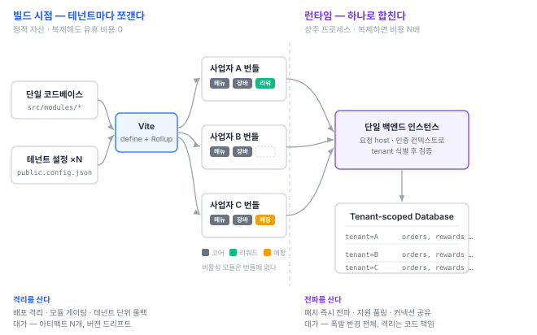

---
# Recommended paths:
# - src/content/notes/ko/<field>/<slug>.md
# - src/content/notes/en/<field>/<slug>.md
title: "프론트는 테넌트마다 쪼개고, 백엔드는 하나로 합쳤다"
lang: "ko"
translationKey: "tenant-split-frontend-backend"
date: "2026-08-08"
# field: "web" | "game" | "programming-language" | "ai" | "blog"
field: "web"
category: "아키텍처"
series: "모먼트 커피"
order: 1
# status: "draft" | "reading" | "implemented" | "stable"
status: "draft"
summary: "같은 멀티테넌트 서비스인데 프론트엔드는 사업자마다 별도 빌드하고 백엔드는 단일 인스턴스로 묶었다. 자원의 성질이 다르기 때문이다."
problem: "멀티테넌트 서비스에서 테넌트 분리 지점을 어디에 둘 것인가? 프론트와 백엔드가 왜 서로 다른 답을 갖는가?"
coreIdea: "정적 자산은 복제해도 유휴 비용이 0이지만 서버 프로세스는 복제하면 상주 비용이 생긴다. 그래서 프론트는 빌드 시점에 쪼개 격리를 얻고, 백엔드는 런타임에 합쳐 자원 풀링과 패치 전파를 얻는다."
connection: "빌드타임 상수, 폭발 반경, 자원 풀링, 테넌트 격리, 번들러 선택"
tags: ["아키텍처", "멀티테넌트", "vite", "모먼트커피"]
---

# 프론트는 테넌트마다 쪼개고, 백엔드는 하나로 합쳤다

## 1. 이 시리즈에 대해

모먼트 커피는 카페 주문 서비스다. 사용자는 매장 방문 전이나 방문 중에 메뉴를 탐색하고 주문하며, 주문 실적에 따라 리워드를 적립하고 인근 매장을 찾는다. 그리고 이 앱은 **여러 사업자가 각자의 브랜드로 사용한다.**

이 시리즈는 그 프론트엔드를 설계하면서 내린 결정들을 기록한다. 기능 소개가 아니라 **왜 그렇게 정했고, 그 대가로 무엇을 잃었는지**를 쓴다. 선택에는 항상 포기한 쪽이 있는데 결과물만 보면 그게 안 보이기 때문이다.

첫 글은 나머지 결정 전부가 종속되는 하나를 다룬다. **테넌트를 어디서 쪼갤 것인가.**

> [!note] 이 글의 상태
> 설계 문서 단계이고 아직 구현 전이다. 벤치마크나 운영 실측치는 없으며, 요구사항에서 연역한 판단과 그 판단의 예상 비용을 적는다.

---

## 2. 요구가 강제하는 것

명세에서 이 결정을 실제로 구속하는 조항은 넷이다. 나머지는 어떤 구조로도 만들 수 있어서 판단 근거가 되지 못한다.

| 조항 | 내용 |
|---|---|
| C1 | 프론트엔드 앱은 사업자별 설정을 주입하여 **별도로 빌드·배포**한다 |
| C2 | 비활성 모듈의 화면·탭은 **빌드에서 제외**된다 |
| C3 | 앱 이름·로고·색상·서체를 **코드 수정 없이** 교체할 수 있어야 한다 |
| C4 | 사업자별 **개별 코드 분기를 두지 않는다** |

C2와 C4가 같이 있는 게 까다롭다. "사업자마다 다른 앱"이어야 하는데 "사업자별 코드 분기는 없어야" 하고, 게다가 "비활성 모듈은 번들에 남아 있어도 안 된다." 세 조건이 서로를 밀어낸다.

여기에 사업 조건이 하나 더 붙는다. 대상이 **소상공인**이다. 사업자 한 명당 트래픽이 작고, 사업자당 고정비가 곧 사업 모델의 손익분기를 결정한다.

---

## 3. 결정 — 비대칭 구조

결론부터 쓰면 이렇다.

| 층 | 테넌트 분리 지점 | 결과물 |
|---|---|---|
| **프론트엔드** | **빌드 시점** | 사업자 수 N만큼의 정적 번들. 각각 다른 모듈 구성·브랜드 |
| **백엔드** | **런타임 (데이터 계층)** | **단일 인스턴스.** 요청의 테넌트를 식별해 데이터를 격리 |

그림으로 보면 형태가 드러난다. **왼쪽에서 발산하고 오른쪽에서 수렴한다.** 코드베이스 하나가 빌드 시점에 N개로 갈라지는데, 갈라진 번들마다 들어 있는 모듈이 다르다. 그리고 그 N개가 런타임에는 다시 하나의 백엔드로 모이고, 격리는 데이터 계층으로 내려간다.

같은 서비스인데 층마다 답이 다르다. 두 층이 다루는 **자원의 성질이 다르다**는 걸 바탕으로 위 구조를 채택한 이유를 서술하고자 한다.

---

## 4. 왜 비대칭인가 — 복제 비용이 다르다

### 4.1 정적 자산은 복제해도 유휴 비용이 0이다

프론트엔드 빌드 산출물은 HTML·JS·CSS 파일 덩어리다. 이걸 오브젝트 스토리지에 올려두면 **아무도 안 쓰는 동안에는 아무 자원도 먹지 않는다.** 저장 용량만 차지하고, 그건 번들 하나에 수 MB 수준이다.

사업자가 10명이면 번들이 10개다. 그런데 10배가 된 건 **디스크 사용량뿐**이고, CPU도 메모리도 커넥션도 늘지 않는다. 요청이 오면 그때 CDN이 파일을 내려줄 뿐이다.

즉 프론트엔드는 **복제가 거의 공짜다.** 그러면 복제해서 얻을 수 있는 것을 가져가는 게 이득이다.

### 4.2 서버 프로세스는 복제하면 상주 비용이 생긴다

백엔드는 반대다. 인스턴스 하나를 띄우면 **아무 요청이 없어도** 메모리를 점유하고, DB 커넥션 풀을 잡고, 헬스체크에 응답하고, 런타임이 상주한다.

사업자마다 인스턴스를 따로 띄우면 이 상주 비용이 N배가 된다. 그런데 소상공인 대상 서비스에서 사업자 한 명당 트래픽은 작다. **인스턴스 대부분이 유휴 상태로 자원만 먹는 구조**가 된다.

합치면 반대 효과가 난다.

- **자원 풀링.** 매장마다 피크 시간이 다르다. 오피스가 매장은 아침, 대학가 매장은 오후에 몰린다. 하나의 인스턴스가 이 파도를 나눠 받으면 최대치 기준으로 잡아야 할 용량이 개별 합보다 작다
- **커넥션 풀 공유.** DB 커넥션은 비싼 자원이라 인스턴스마다 풀을 따로 잡으면 낭비가 크다

### 4.3 정리

> **복제가 싼 층은 쪼개고, 복제가 비싼 층은 합친다.**

프론트엔드를 쪼개서 얻는 것(모듈 게이팅, 브랜드 분리, 배포 격리)의 대가는 디스크뿐이다. 백엔드를 쪼개서 얻는 것(장애 격리)의 대가는 상주 비용 N배다. 그래서 분리 지점이 층마다 다르다.

---

## 5. 구현 수단 — 번들러로 Vite를 채택했다

프론트를 "쪼갠다"는 게 실제로는 무엇인가. 빌드 시점에 테넌트 설정을 소스에 주입하고, **그 사업자가 쓰지 않는 모듈을 번들에서 아예 제거**하는 것이다. C2가 요구하는 게 정확히 이거다.

여기서 제약이 하나 따라 나온다. **이 요구는 런타임 조건문으로는 만족할 수 없다.** `if (config.enabledModules.includes("reward"))`처럼 실행 중에 판정하면 리워드 화면 코드는 어차피 번들에 들어 있어야 한다. 화면에 안 보일 뿐 사용자는 그 코드를 다운로드한다. "빌드에서 제외"라는 문장을 지키려면 **값이 빌드 시점에 확정되어야 한다.**

그래서 번들러 선택이 도구 취향이 아니라 아키텍처 결정이 된다. 이 프로젝트는 **Vite를 번들러로 채택**했다.

같은 이유로 메타프레임워크를 쓰지 않았다. 서버 렌더링을 붙이는 방법이 둘인데 **양쪽 다 막힌다.**

| 배포 형태 | 결과 |
|---|---|
| 단일 멀티테넌트 배포 (host로 분기) | 런타임은 1개라 비용 문제가 없다. 그러나 모든 사업자의 모든 모듈 코드가 한 번들에 들어간다 → **C2 위반** |
| 사업자별 개별 배포 | C2는 만족하지만 SSR을 쓰는 순간 사업자별 서버 런타임이 필요하다 → 4.2의 상주 비용 문제 |

흔히 드는 "사업자 N명이면 서버 N개"라는 논거는 첫 번째 형태로 반박된다. 그래서 기각의 **일차 근거는 비용이 아니라 C2**다. 이건 트레이드오프가 아니라 요구사항 미충족이다.

> [!note] 다음 글로 넘긴 것
> 번들러가 **어떤 원리로** 안 쓰는 코드를 제거하는지, Vite와 Webpack이 그 지점에서 어떻게 다른지, 그래서 왜 Vite가 이 요구에 더 맞는지는 분량이 커서 다음 글에서 따로 다룬다.

---

## 6. 안정성 — 격리와 전파는 맞바꾸는 관계다

자원만 보면 결정이 끝난 것 같지만, 안정성 축에서 보면 두 층이 **정반대 성질**을 갖는다. 이게 이 설계에서 제일 흥미로운 부분이었다.

### 6.1 프론트: 격리를 얻고 전파를 잃는다

사업자별 빌드는 폭발 반경이 작다. CI 매트릭스로 독립 빌드하면 **테넌트 A의 설정 오류가 B의 배포를 막지 않는다.** 배포도 테넌트 단위로 롤백된다.

대신 잃는 게 있다. **아티팩트 버전 드리프트.**

사업자가 N명이면 프로덕션에 N개 버전이 동시에 존재한다. A는 최신인데 B는 몇 달 전 빌드에 머물러 있을 수 있다. 이 상태에서 보안 패치를 내면 N개를 전부 재빌드·재배포해야 하고, **하나라도 누락되면 조용히 취약한 채 남는다.**

실패가 눈에 안 띄는 종류라서 더 위험하다. 아무도 에러를 보지 않는다.

### 6.2 백엔드: 전파를 얻고 격리를 잃는다

단일 인스턴스는 정확히 반대다. 패치를 배포하면 **모든 테넌트에 즉시 적용된다.** 버전 드리프트가 구조적으로 생길 수 없다.

대신 폭발 반경이 전체다. 인스턴스 장애는 전 사업자 장애다. 여기에 두 가지가 더 붙는다.

- **테넌트 간 데이터 격리를 코드로 보장해야 한다.** 쿼리 하나에서 테넌트 조건을 빠뜨리면 다른 사업자 데이터가 노출된다. 물리적으로 분리된 게 아니라서 실수가 곧 사고다
- **노이지 네이버.** 한 사업자의 트래픽 급증이 다른 사업자의 응답 시간에 영향을 준다

### 6.3 그래서 각 층이 다른 방식으로 방어한다

| 층 | 위험 | 방어 |
|---|---|---|
| 프론트 | 패치 누락이 조용히 남는다 | **배포 인벤토리** — 어떤 테넌트가 어떤 커밋으로 빌드됐는지 추적하고, CI가 뒤처진 테넌트를 리포트 |
| 프론트 | 공통 코드 변경이 N개에 동시 영향 | **카나리 테넌트** — 하나에 먼저 배포하고 통과 후 나머지 |
| 백엔드 | 테넌트 데이터 교차 노출 | 프론트가 보내는 `tenantId`를 **권한 근거로 쓰지 않는다.** 서버가 요청 host·인증 컨텍스트의 테넌트와 리소스의 테넌트를 대조해 검증 |
| 백엔드 | 전체 장애 | 데이터 계층에서 테넌트 범위를 강제하고, 배포는 점진적으로 |

특히 세 번째가 중요하다. 백엔드를 합치기로 한 이상 **격리는 인프라가 아니라 코드가 책임진다.** 클라이언트가 자기 테넌트를 주장하게 두면 그 순간 격리가 무너진다.

### 6.4 열어 둔 확장 경로 — 하드웨어 격리

6.2의 "폭발 반경이 전체"는 지금 구조에서 가장 큰 미해결 항목이다. 여기서 흔한 오해를 하나 짚어 둔다.

**같은 빌드 산출물을 여러 서버에 복제 배포하는 것(수평 확장)은 격리가 아니다.** replica를 10개로 늘리면 용량은 10배가 되지만, 코드 결함은 10개 replica 전부에 똑같이 들어 있고 모든 replica가 모든 테넌트를 처리한다. 폭발 반경은 그대로다. 수평 확장이 사는 건 **가용성과 처리량**이지 격리가 아니다.

격리를 실제로 사려면 **셀(cell) 단위로 나눠야 한다.** 같은 이미지를 여러 셀에 배포하되, 각 셀이 **자기에게 배정된 테넌트 집합만** 처리하게 한다. 그러면 장애가 셀 안에 갇히고 폭발 반경이 전체에서 1/셀 수로 줄어든다. 대형 테넌트만 전용 셀로 떼는 하이브리드도 같은 틀에서 나온다.

다만 공짜가 아니다.

- **stateless가 전제다.** 세션이나 캐시를 인스턴스 메모리에 두는 순간 복제 자체가 불가능해진다. 상태는 전부 DB나 공유 캐시로 밀어내야 한다
- **셀마다 최소 용량이 필요하다.** 4.2에서 합쳐서 얻었던 자원 풀링 이득이 셀 수만큼 다시 쪼개진다. 격리를 사는 대가로 풀링을 되파는 셈이다
- **테넌트–셀 배정과 이동**이라는 운영 문제가 새로 생긴다

지금 규모에서는 도입하지 않는다. 8장의 트래픽 조건이 충족되는 시점에 꺼내는 카드로 남겨 둔다.

---

## 7. Trade-off 정리

| | 얻는 것 | 잃는 것 |
|---|---|---|
| **프론트 per-tenant 빌드** | C2 문자 그대로 충족 (비활성 모듈 번들에서 제거) · 사업자별 초기 로드 최소화 · 배포 격리 · 테넌트 단위 롤백 · C4 구조적 강제 | 설정 하나 바꿔도 재빌드·재배포 · 빌드 시간이 N에 비례 · 아티팩트 N개 관리 · **버전 드리프트** |
| **백엔드 단일 인스턴스** | 상주 비용이 N에 비례하지 않음 · 자원 풀링 · 커넥션 풀 공유 · **패치 즉시 전파** · 버전 드리프트 없음 | 폭발 반경이 전체 · 데이터 격리를 코드가 책임짐 · 노이지 네이버 |

한 줄로 줄이면 이렇다.

> 프론트는 **격리를 사고 전파를 팔았고**, 백엔드는 **전파를 사고 격리를 팔았다.** 각 층에서 그 자원이 실제로 비싼 쪽을 기준으로 거래했다.

---

## 8. 이 설계가 무너지는 조건

지금 맞다고 해서 계속 맞는 건 아니다. 재검토해야 하는 지표를 미리 적어 둔다.

- **사업자 수 20~30개 초과, 또는 전체 빌드 15분 초과.** 4.1의 "복제가 거의 공짜"라는 전제가 흔들린다. 디스크는 여전히 싸지만 **빌드 시간과 배포 대상 관리**가 비용이 된다. 이때는 브랜딩만 런타임으로 넘기거나 변경분만 빌드하는 증분 파이프라인으로 간다
- **사업자당 트래픽이 커짐.** 4.2의 "대부분 유휴" 전제가 깨지면 합쳐서 얻는 풀링 이득이 줄고, 노이지 네이버가 실제 문제가 된다. 대형 테넌트만 별도 인스턴스로 떼는 하이브리드가 후보
- **테넌트별 규제·데이터 격리 요구.** 물리적 분리를 요구받으면 6.2의 코드 기반 격리로는 부족하다

---

## 9. 다음 글

이 결정이 정해지고 나면 나머지가 여기에 종속된다. 라우팅은 빌드 상수로 라우트 배열을 구성해야 하고, 스타일 토큰은 테넌트별 CSS 변수로 갈라져야 하며, 상태 관리는 "서버가 진실 소스"라는 전제 위에서 다시 설계된다.

다음 글에서는 5장에서 미뤄 둔 것을 먼저 갚는다. **번들러는 무엇이고 어떤 원리로 동작하는가**, Vite와 Webpack은 그 원리의 어디에서 갈라지는가, 그리고 이 프로젝트의 요구에는 왜 Vite가 더 맞는가.

그 다음 글에서 상태 계층으로 넘어간다. 서버 데이터를 값이 아니라 캐시로 취급한다는 게 무슨 뜻인지, 그 관점이 라이브러리 선택을 어떻게 결정했는지.
